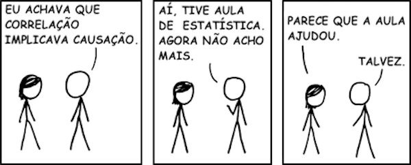
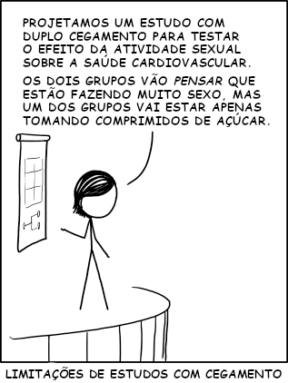

--- 
knit: "bookdown::render_book"
---


# O Que É Estatística? {#oque}

## Vídeo 1

```{r echo=FALSE, results='asis', out.extra=center()}
embed_yt('6Q_XSoLCIpc')
```

## Exercícios

1. Em que momento do vídeo a tela fica preta?

1. População x amostra ?td?

1. Parâmetro x estatística ?td?

1. Qual a graça dos quadrinhos na Figura \@ref(fig:xkcd-cor), que também [aparecem no vídeo (com áudio brilhante, aliás)](https://youtu.be/6Q_XSoLCIpc?t=1385)?

    ```{r xkcd-cor, echo=FALSE, fig.cap='(ref:552)'}
    
    ```

1. Qual a graça dos quadrinhos na Figura \@ref(fig:xkcd-blind)?

    ```{r xkcd-blind, echo=FALSE, fig.cap='(ref:1462)', out.width='50%'}
    
    ```

1. Veja este vídeo sobre o cavalo Hans:

    ```{r echo=FALSE, results='asis', out.extra=center()}
    embed_yt('G3VkCmdUfZE')
    ```
   Qual a relação entre esta história e a necessidade de duplo cegamento?

1. Diferença entre amostragem com reposição e sem reposição ?td? População infinita. Exemplo com baralho muuuuito grande.

1. Técnicas de amostragem ?td?


(ref:552) http://xkcd.com/552/

(ref:1462) http://xkcd.com/1462/


## Vídeo 2

```{r echo=FALSE, results='asis', out.extra=center()}
embed_yt('492VASxlDRo')
```

## Exercícios


