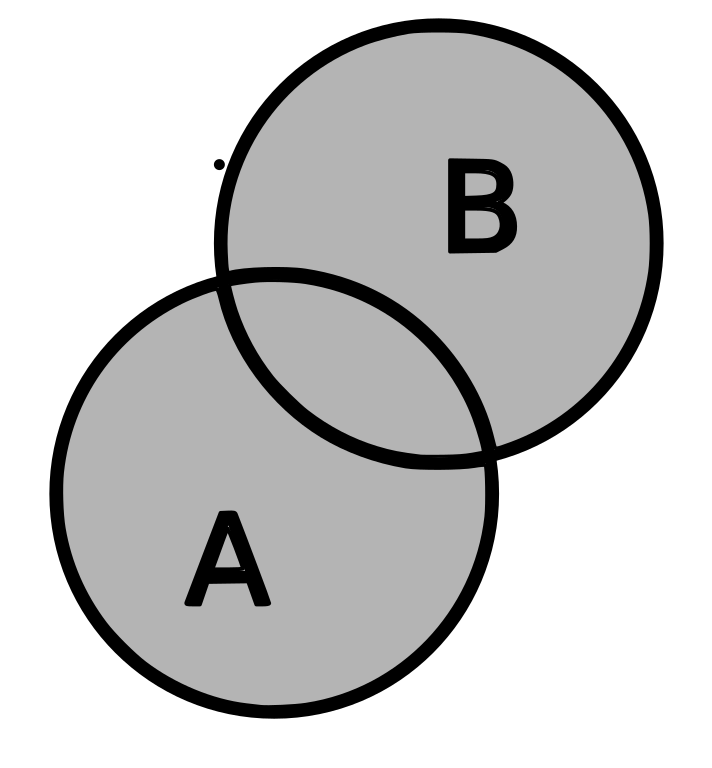

--- 
knit: "bookdown::render_book"
---

# Probabilidades {#probs}

## Vídeo 1

```{r echo=FALSE, results='asis', out.extra=center()}
embed_yt('hJfyzRzEs44')
```

## Espaço amostral

* Para falar em probabilidades, precisamos falar de [experimentos, resultados, espaços amostrais, e eventos]{.hl}.

* Um [experimento probabilístico]{.hl} é um experimento cujo resultado exato é desconhecido *a priori*; mais ainda: [executar o experimento diversas vezes, nas mesmas condições, pode produzir resultados diferentes]{.hl}.

* O [espaço amostral]{.hl} é o conjunto de [todos os resultados possíveis]{.hl} de um experimento probabilístico, representados de alguma forma.

* Exemplos:

  1. Experimento: lançar uma moeda;  
     Espaço amostral: $\{ K, C \}$ (onde $K$ é cara, $C$ é coroa).
  
  1. Experimento: lançar $2$ moedas;  
     Espaço amostral: $\{ (K,K), (K,C), (C,K), (C,C) \}$.
     
  1. Experimento: lançar um dado;  
     Espaço amostral: $\{ 1, 2, 3, 4, 5, 6 \}$.
  
  1. Experimento: lançar $2$ dados:  
     Espaço amostral: $\{ (1, 1), (1, 2), \ldots, (6, 5), (6, 6) \}$.


## Evento

* Um [evento]{.hl} é um subconjunto do espaço amostral; ou seja, um evento é um [conjunto de resultados]{.hl}.

* Exemplos:

  1. Lançar uma moeda e [obter cara]{.hl}:  
     $\{ K \}$.
  
  1. Lançar 2 moedas e [obter resultados iguais]{.hl}:  
     $\{ (K,K), (C,C) \}$.
  
  1. Lançar um dado e [obter um número maior que 4]{.hl}:  
     $\{ 5, 6 \}$.
  
  1. Lançar 2 dados e [obter 2 números iguais]{.hl}:  
     $\{ (1,1), (2,2), (3,3), (4,4), (5,5), (6,6) \}$.
  
* Dizemos que [o evento $A$ ocorreu]{.hl} se o experimento foi realizado e [o resultado obtido está no conjunto que corresponde ao evento $A$]{.hl}.


## Análise Combinatória

* Para calcularmos probabilidades, vamos precisar [contar a quantidade de certos objetos complexos]{.hl} (formados por partes menores).

* Existem [técnicas de contagem]{.hl}, que são assunto de [Análise Combinatória]{.hl}.

* Exemplos:

  1. Quantas senhas de $6$ caracteres (dentre letras e dígitos apenas) existem, [sem distinguir entre minúsculas e maiúsculas]{.hl}?
  
     `r inicio_resposta()`
     
     * O conjunto de letras e dígitos tem $36$ elementos.
     
     * A resposta é $36^{6} = 2.176.782.336$.
     
     `r fim_resposta()`
     

  1. E se não puder haver repetição de caracteres?
  
     `r inicio_resposta()`
     
     * Agora, a resposta é
       $$
       36 \cdot 35 \cdot 34 \cdot 33 \cdot 32 \cdot 31 = 1.402.410.240
       $$
     
     `r fim_resposta()`

* Se você nunca tiver estudado técnicas de contagem, ou se quiser revisar ou aprender mais, consulte o excelente livro @morgadoAnaliseCombinatoriaProbabilidade2004.


## Probabilidade clássica

* Nesta abordagem simples --- que pode não ser a correta para o problema que estamos tentando resolver ---, [cada resultado do espaço amostral tem a mesma chance de ocorrer]{.hl}.

* Ou seja, para um evento $A$, a probabilidade $P(A)$ é

  $$
  P(A) = \frac{\text{Qtde de resultados em } A}{\text{Qtde de resultados no espaço amostral}}
  $$
  
* Exemplo: de um baralho normal, de $52$ cartas, qual a probabilidade de escolher uma carta ao acaso e obter

  1. Uma carta de ouros?
  
     `r inicio_resposta()`
     
     $$
     \frac{13}{52} = \frac{1}{4}
     $$
     
     `r fim_resposta()`
     
  2. Uma carta vermelha?
  
     `r inicio_resposta()`
     
     $$
     \frac{26}{52} = \frac{1}{2}
     $$
     
     `r fim_resposta()`

  3. Uma carta de figura (J, Q ou K)?
  
     `r inicio_resposta()`
     
     $$
     \frac{12}{52} = \frac{3}{13}
     $$
     
     `r fim_resposta()`

  4. Uma carta de ouros, copas, paus ou espadas?
  
     `r inicio_resposta()`
     
     $$
     \frac{52}{52} = 1
     $$
     
     `r fim_resposta()`
  
  5. Um carta de um naipe verde?
  
     `r inicio_resposta()`
     
     $$
     \frac{0}{52} = 0
     $$
     
     `r fim_resposta()`

  ::: {.rmdcaution latex=1}
  
  Só podemos usar este raciocínio [se todos os resultados do experimento tiverem a mesma probabilidade]{.hl} de ocorrer. 
  
  Como a carta é escolhida [ao acaso]{.hl}, esta condição é satisfeita neste exemplo.
  
  :::


## Probabilidade empírica

* Baseada em [repetições de um experimento probabilístico]{.hl}.

* Nesta abordagem, a probabilidade de um evento é sua [frequência relativa]{.hl}:

  $$
  P(A) = \frac{\text{Qtde de ocorrências de } A}{\text{Qtde total de repetições do experimento}}
  $$
  
* Esta abordagem é fácil de usar quando é possível repetir o experimento muitas vezes, nas mesmas condições (lançar uma moeda, escolher uma carta de um baralho).

* Em outros casos (calcular a probabilidade de um candidato vencer uma eleição), não é possível repetir o experimento nas mesmas condições.

* Exemplo: se lançarmos uma moeda não-viciada muitas vezes, a proporção de caras vai ser aproximadamente $0{,}5$. Os gráficos abaixo mostram como, à medida que o número de lançamentos aumenta (no eixo horizontal), a proporção de caras (no eixo vertical) vai se aproximando de $0{,}5$:
  
    ```{r lancar-e-plotar-caras, echo=FALSE}
    lancar <- function(lancamentos, n = 100) {
    
      moeda <- c('k', 'c')
      novos <- sample(moeda, n, replace = TRUE)
      c(lancamentos, novos)
      
    }
    
    plotar <- function(lancamentos) {
      
      n <- length(lancamentos)
      caras <- tibble(caras = cumsum(lancamentos == 'k')/(1:n))
    
      intervalo <- 10 ^ (ceiling(log10(n)) - 1)  
      grafico <- caras %>% 
        ggplot(aes(x = 1:n, y = caras)) +
          geom_line(color = 'blue') +
          scale_y_continuous(
            name = '',
            breaks = seq(0, 1, 0.1),
            limits = c(0,1)
          ) +
          scale_x_continuous(
            name = 'lançamentos',
            breaks = seq(0, n, intervalo)
          ) +
        theme(
          axis.text.x = element_text(angle = 45),
          axis.title.x = element_text(vjust = 8)
        )
      
      # print(grafico)
      grafico
      
    }
    ```

    ```{r lancar, fig.height=15, echo=FALSE}
    resultados <- vector()
    graficos <- list()
    
    for (i in 1:10) {
      resultados <- lancar(resultados)
      graficos[[i]] <- plotar(resultados)
    }
    
    wrap_plots(
      graficos, 
      ncol = 2, 
      byrow = TRUE,
      heights = unit(10, 'lines')
    )
    ```


* A [[lei dos grandes números]{.hl}](https://pt.wikipedia.org/wiki/Lei_dos_grandes_n%C3%BAmeros) é um resultado matemático que diz, essencialmente, que, [quando o número $n$ de repetições de um experimento tende a infinito, a frequência relativa de um evento tende à sua probabilidade real]{.hl}.


  ::: {.rmdcaution latex=1}
  
  **A falácia do jogador**
  
  Um [erro comum]{.hl} é achar que, se houve poucas caras nos lançamentos mais recentes, então a probabilidade de o resultado ser cara no próximo lançamento é maior, para que a proporção de caras fique mais perto de $0{,}5$.
  
  A lei dos grandes números fala sobre os resultados do experimento quando $n$ tende ao infinito, [não no futuro próximo]{.hl}.
  
  Em lançamentos [independentes]{.hl} de uma moeda [não-viciada]{.hl}, a probabilidade de cara [sempre]{.hl} é $0{,}5$.
  
  :::


## Probabilidade subjetiva

* Outra interpretação de probabilidades se baseia na [crença]{.hl} --- a estimativa de um agente sobre a ocorrência de um evento.

* Uma maneira de quantificar a crença é através de [apostas justas]{.hl}.

* Por exemplo, você aposta com um amigo que

  * Se o seu time de basquete^[Considere que, no basquete, o empate é impossível.] vencer o próximo jogo contra o dele, ele pagará $\$3$ para você.
  
  * Se o time dele vencer o próximo jogo contra o seu, você pagará $\$1$ para ele. 
  
* Se você considera justa esta aposta, então [você crê que a probabilidade de o time dele vencer é $3$ vezes maior do que a probabilidade de o seu time vencer]{.hl}. 

* Como [a soma das probabilidades de um evento e do evento complementar deve ser $1$]{.hl}, isto equivale a dizer que

  $$
  P(\text{seu time vencer}) = 1/4 \qquad\text{e}\qquad  P(\text{time dele vencer}) = 3/4
  $$
  
* Em mais detalhes:

  * Você pode receber menos com uma probabilidade maior,
  
  * Seu amigo pode receber mais com uma probabilidade menor,
  
  * A razão entre as quantias ($3$) é contrabalançada exatamente pela razão entre as probabilidades ($1/3$).


## Formalização de probabilidades {#axiomas}

* Para trabalhar matematicamente com probabilidades, é preciso definir as "regras do jogo".

* [Tudo]{.hl} que se pode concluir sobre probabilidades é [consequência dos seguintes axiomas]{.hl}, [formulados por Kolmogorov em 1933](https://pt.wikipedia.org/wiki/Axiomas_de_probabilidade#Axiomas):

  1. $0 \leq P(A) \leq 1$, para qualquer evento $A$.

  2. $P(\Omega) = 1$, onde $\Omega$ é o espaço amostral (o conjunto de todos os resultados possíveis do experimento em questão);

  3. $P(\bar A) = 1 - P(A)$, onde $\bar A$ é o evento [complementar]{.hl} de $A$ (i.e., o evento que corresponde a $A$ [não]{.hl} ocorrer)

  4. $P(A_1 \cup \cdots \cup A_n) = P(A_1) + \cdots + P(A_n)$, onde $A_1, \ldots, A_n$ são eventos [disjuntos dois a dois]{.hl} (i.e., $A_i$ e $A_j$ [não podem ocorrer ao mesmo tempo]{.hl}, para todo par $(i, j)$ com $i \neq j$).

* Mostre, a partir dos axiomas acima, que

  $$
  P(\varnothing) = 0
  $$

  `r inicio_dica()`
  
  $$\varnothing = \bar \Omega $$
  
  `r fim_dica()`

  `r inicio_resposta()`
  
  $$
  \begin{aligned}
    P(\varnothing) 
    &= P(\bar \Omega) \\
    &= 1 - P(\Omega) & \text{(pelo axioma 3)}\\
    &= 1 - 1 & \text{(pelo axioma 2)} \\
    &= 0
  \end{aligned}
  $$
  
  `r fim_resposta()`
  
    
  

## Eventos independentes (explicação informal)

* Se a ocorrência de $A$ [não influencia]{.hl} a ocorrência de $B$, nem vice-versa, dizemos que os eventos $A$ e $B$ são [independentes]{.hl}.

* Exemplo: 

  * O experimento é [lançar um dado duas vezes]{.hl}.

  * $A$ é o evento o [primeiro lançamento deu um número par]{.hl}.

  * $B$ é o evento [o segundo lançamento deu 6]{.hl}.
  
  * Saber se $A$ aconteceu [não nos ajuda]{.hl} em nada a estimar se $B$ aconteceu.
  
  * Aqui, [$A$ e $B$ são independentes]{.hl}.

* Outro exemplo: 

  * O experimento é [lançar um dado duas vezes]{.hl}.

  * $A$ é o evento o [primeiro lançamento deu um número menor que $3$]{.hl}.

  * $B$ é o evento [a soma dos dois lançamentos é maior que $8$]{.hl}.
  
  * Agora, saber se $A$ aconteceu [ajuda]{.hl} a estimar se $B$ aconteceu.
  
  * Na verdade, [se $A$ aconteceu, $B$ é impossível]{.hl} (a probabilidade de $B$, dado $A$, é $0$).
  
  * Se $A$ não aconteceu, a probabilidade de $B$ é $5/12$.
  
  * Aqui, $A$ e $B$ [não são independentes]{.hl}.

* []{#independentes-produto} A probabilidade de os eventos $A$ e $B$ acontecerem ao mesmo tempo é escrita como

  $$
  P(A, B) \qquad \text{ou como} \qquad P(A \cap B)
  $$

* Quando $A$ e $B$ são [independentes]{.hl},

  $$
  P(A, B) = P(A) \cdot P(B)
  $$

* Ou seja, [quando $A$ e $B$ são independentes, a probabilidade de $A$ e $B$ acontecerem ao mesmo tempo é igual ao produto das probabilidades de $A$ e de $B$]{.hl}.

* Mais adiante, vamos ver uma definição formal de independência, e vamos provar esta última igualdade.


## $P(A \cup B)$ com $A$ e $B$ não-disjuntos

* Um dos [axiomas de probabilidade](#axiomas) fala sobre a probabilidade da união de vários eventos [disjuntos]{.hl} (sem elementos em comum):

  $$
  P(A_1 \cup \cdots \cup A_n) = P(A_1) + \cdots + P(A_n)
  $$

* E [se os eventos não forem disjuntos]{.hl}?

* Veja a figura abaixo:

    ```{r echo=FALSE, out.width='30%'}
    
    ```

* Imagine que a probabilidade de um evento é proporcional à sua área nesta figura.

* Se você somar a área de $A$ com a área de $B$, você vai estar [contando duas vezes]{.hl} a área comum aos dois (a área que corresponde a $A \cap B$).

* Por isso, [o certo é "descontar" esta área]{.hl}.

* O resultado é

  $$
  P(A \cup B) = P(A) + P(B) - P(A \cap B)
  $$

* Exemplo: suponha que 25% das pessoas têm cachorro, 29% das pessoas têm gato, e 12% das pessoas têm cachorro e gato.

* Qual a probabilidade de que uma pessoa tenha gato ou cachorro ou ambos?

  $$
  \begin{aligned}
  P(\text{cachorro } \cup \text{ gato}) 
    &= P(\text{cachorro}) + P(\text{gato}) - P(\text{cachorro } \cap \text{ gato}) \\
    &= 0{,}25 + 0{,}29 - 0{,}12 \\
    &= 0{,}42
  \end{aligned}
  $$


* No geral, para $n$ eventos $A_1, \ldots, A_n$:

  $$
  \begin{aligned}
  P(A_1 \cup \cdots \cup A_n) &=
    P(A_1) + \cdots + P(A_n) \\
    & - P(A_1 \cap A_2) - \cdots - P(A_{n-1} \cap A_n) \\
    & + P(A_1 \cap A_2 \cap A_3) + \cdots + P(A_{n-2} \cap A_{n-1} \cap A_n) \\
    & \cdots \\
    & \pm P(A_1 \cap \cdots \cap A_n )
  \end{aligned}
  $$

* Na última linha

  * o sinal vai ser $+$ se $n$ for ímpar;

  * o sinal vai ser $-$ se $n$ for par;
  
  * poderíamos escrever, então, $(-1)^{n+1} \cdot P(A_1 \cap \cdots \cap A_n )$.
  
* Escreva, seguindo o padrão acima, a expressão para 

  $$
  P(A \cup B \cup C)
  $$
  
  `r inicio_resposta()`
  
  $$
  \begin{aligned}
  P(A \cup B \cup C) &=
    P(A) + P(B) + P(C) \\
    & - P(A \cap B) - P(A \cap C) - P(B \cap C) \\
    & + P(A \cap B \cap C)
  \end{aligned}
  $$

  `r fim_resposta()`
  
  
## Problema do aniversário

### Solução teórica

* Em uma sala estão $25$ pessoas escolhidas ao acaso. 

* [Qual a probabilidade de que pelo menos $2$ delas façam aniversário no mesmo dia do ano?]{.hl}

* Premissas:

  * Os dias dos aniversários das pessoas são independentes.

  * Cada dia do ano tem a mesma probabilidade de ser o aniversário de alguém.

  * Vamos ignorar anos bissextos. Cada ano tem 365 dias.

* Queremos achar $P(I)$, onde $I$ é o evento de que pelo menos duas pessoas têm aniversários iguais.

* Vamos calcular a probabilidade $P(N)$ de que [não]{.hl} haja aniversários iguais.

* Este evento $N$ é o complementar do evento $I$, i.e., $N = \bar I$.

* Então, $P(I) = 1 - P(N)$.

* $P(N)$ é a probabilidade de que todos os aniversários caiam em dias diferentes:

  * A pessoa $1$ pode ter nascido em qualquer dia do ano.
  
  * A pessoa $2$ precisa ter nascido em algum dos outros $364$ dias. A probabilidade é $\frac{364}{365}$.
  
  * A pessoa $3$ precisa ter nascido em algum dos outros $363$ dias. A probabilidade é $\frac{363}{365}$.
  
  * $\ldots$
  
  * A pessoa $25$ precisa ter nascido em algum dos outros $341$ dias. A probabilidade é $\frac{341}{365}$.

* [Como os nascimentos são independentes](#independentes-produto), a probabilidade de todos os eventos acontecerem juntos é o produto das probabilidades:

  $$
  P(N) = \frac{364}{365} \cdot \frac{363}{365} \cdot \cdots \cdot
         \frac{341}{365}
       = \frac{364 \cdot 363 \cdot \cdots \cdot 341}{365^{24}}
  $$

* O que dá

    ```{r pn}
    pn <- prod((364:341)/365)
    pn
    ```

* Então, $P(I)$ é

    ```{r pi}
    1 - pn
    ```

* Surpreso? Com $25$ pessoas na sala, é mais provável haver do que não haver coincidência de aniversários!


### Simulação

* Vamos simular milhares de salas com $25$ pessoas satisfazendo as [premissas](#premissas) e ver em quantas delas há coincidência de aniversários. Examine o código abaixo:

    ```{r aniversario}
    nsalas <- 1e4
    npessoas <- 25
    
    coincidencia <- function(sala) {
    
      # Se a quantidade de valores únicos for diferente 
      # da quantidade total de valores, então há repetição  
      !(length(unique(sala)) == length(sala))
      
    }
    
    gerar_e_testar <- function(npessoas) {
      
      # Escolhemos, ao acaso, npessoas números entre 1 e 365,
      # com reposição
      sala <- sample(1:365, npessoas, replace = TRUE)
      
      # Testamos se há alguma coincidência de aniversários
      coincidencia(sala)
      
    }
    
    simular <- function(npessoas, nsalas) {
      
      resultados <- replicate(nsalas, gerar_e_testar(npessoas))
      
      # Como resultados é um vetor booleano, tirar a média
      # vai dar a proporção de resultados verdadeiros,
      # que é a probabilidade.
      mean(resultados)
    
    }
    
    simular(npessoas, nsalas)
    ```

### Para diferentes valores de $n \in \{2, 3, \ldots, 50\}$

#### Soluções teóricas {-}

* Vamos calcular as probabilidades de coincidência para diferentes quantidades $n$ de pessoas na sala e fazer um gráfico:

    ```{r n-teorico}
    npessoas <- 2:50
    
    p <- function(n) {
      
      # Fórmula geral, para n pessoas
      1 - prod((364:(366 - n))/365)
      
    }
    
    probs <- sapply(npessoas, p)
    
    grafico <- probs %>% 
      as_tibble() %>% 
      ggplot(aes(x = npessoas, y = value)) +
        geom_line(color = 'blue') +
        labs(
          title = 'Probabilidades de coincidência com n pessoas',
          y = NULL,
          x = 'n'
        )
    
    grafico
    ```

* Este problema é tão usado em cursos de probabilidade que o R oferece as funções `pbirthday` e `qbirthday`.

* Leia a ajuda de `pbirthday` e recrie o gráfico acima usando esta função.

* Leia a ajuda de `qbirthday` e responda:

  * Quantas pessoas são necessárias para que a probabilidade de uma ou mais coincidências seja de pelo menos $50\%$?
  
    `r inicio_resposta()`
    
    Os valores *default* dos argumentos resolvem este problema:
    
    ```{r}
    qbirthday()
    ```

    `r fim_resposta()`
    
  * Quantas pessoas são necessárias para que a probabilidade de uma ou mais coincidências seja de pelo menos $90\%$?
  
    `r inicio_resposta()`
    
    ```{r}
    qbirthday(.9)
    ```

    `r fim_resposta()`

  * Quantas pessoas são necessárias para que haja uma probabilidade de pelo menos $50\%$ de que $5$ ou mais pessoas façam aniversário no mesmo dia?

    `r inicio_resposta()`
    
    ```{r}
    qbirthday(coincident = 5)
    ```

    `r fim_resposta()`


#### Simulação {-}

```{r n-simul}
nsalas <- 1e3
npessoas <- 2:50

probs_sim <- sapply(npessoas, simular, nsalas)

grafico +
  geom_line(
    data = as_tibble(probs_sim),
    mapping = aes(y = value),
    color = 'red'
  ) +
  labs(
    subtitle = '(teóricas em azul, simulações em vermelho)'
  )
```


### Premissas mais realistas

* [Vamos considerar anos bissextos]{.hl}. O total de dias muda para $366$, mas um dos dias ($29$ de fevereiro) tem $1/4$ da probabilidade de um dia normal de ser o aniversário de alguém.

* [Além disso]{.hl}, vamos supor que haja $165$ dias em que a probabilidade de alguém nascer é $25\%$ maior do que nos $200$ dias normais.

* A solução teórica é bem mais complexa do que no caso uniforme!

* Vamos fazer apenas a simulação. 

* Preste atenção no vetor `pesos`, que representam as probabilidades de dias diferentes:

  * $200$ dias normais têm peso $4$;
  
  * $165$ dias mais prováveis têm peso $5$;
  
  * $1$ dia ($29$ de fevereiro) tem peso $1$.
  
* [Estes pesos não são probabilidades, porque a soma deles não é $1$]{.hl}.

* A função `sample` [normaliza]{.hl} automaticamente estes pesos. 

* Normalizar significa dividir todos os valores pela mesma constante, de forma que a soma seja $1$.

    ```{r premissas-real}
    nsalas <- 1e3
    npessoas <- 2:50
    
    pesos <- c(
      rep(4, 200),    # dias normais
      rep(5, 165),    # dias mais prováveis
      1               # 29 de fevereiro
    )
    
    gerar_e_testar <- function(npessoas, pesos) {
      
      sala <- sample(1:366, npessoas, replace = TRUE, prob = pesos)
      coincidencia(sala)
      
    }
    
    simular <- function(npessoas, nsalas, pesos) {
      
      resultados <- replicate(nsalas, gerar_e_testar(npessoas, pesos))
      mean(resultados)
    
    }
    
    novas_probs <- sapply(npessoas, simular, nsalas, pesos)
    
    grafico +
      geom_line(
        data = as_tibble(novas_probs),
        mapping = aes(y = value),
        color = 'red'
      ) +
      labs(
        subtitle = paste(
          '(teóricas, premissas originais: azul;', 
          'simulações, novas premissas: vermelho)'
        )
      )
    ```

* As novas premissas não mudaram muita coisa.

* Escreva a versão normalizada do vetor `pesos`.

  `r inicio_resposta()`
  
  O vetor original é
  
  $$
  (
  \underbrace{4, \ldots, 4}_{200\text{ vezes}},\;\; 
  \underbrace{5, \ldots, 5}_{165\text{ vezes}},\;\;
  1
  )
  $$
  
  A soma de todos os elementos é 
  
  $$
  200 \cdot 4 + 165 \cdot 165 + 1 = 1.626
  $$
  
  O vetor normalizado fica
  
  $$
  \left(
  \underbrace{\frac4{1626}, \ldots, \frac4{1626}}_{200\text{ vezes}},\;\; 
  \underbrace{\frac5{1626}, \ldots, \frac5{1626}}_{165\text{ vezes}},\;\; 
  \frac1{1626}
  \right)
  $$
  
  ou
  
  $$
  \left(
  \underbrace{\frac2{813}, \ldots, \frac2{813}}_{200\text{ vezes}},\;\; 
  \underbrace{\frac5{1626}, \ldots, \frac5{1626}}_{165\text{ vezes}},\;\; 
  \frac1{1626}
  \right)
  $$

  `r fim_resposta()`
  

## Exercícios

### Semanas com mais nascimentos

* Imagine que $50\%$ dos nascimentos de um ano aconteçam em um período de $15$ semanas, e o restante dos nascimentos seja distribuído de maneira uniforme no restante do ano. Ignore anos bissextos. 

* Faça simulações como na seção anterior ($2 \leq n \leq 50$) e construa o gráfico comparando com as probabilidades teóricas (com as premissas originais).

* Interprete o resultado.

  `r inicio_resposta()`
  
  * $15$ semanas são $105$ dias.

  * O restante do ano tem $260$ dias.

    ```{r cache=TRUE}
    nsalas <- 1e4
    npessoas <- 2:50
    
    # Probabilidades teóricas, premissas originais
    p <- function(n) {
      
      1 - prod((364:(366 - n))/365)
      
    }
    
    probs <- sapply(npessoas, p)
    
    grafico <- probs %>% 
      as_tibble() %>% 
      ggplot(aes(x = npessoas, y = value)) +
        geom_line(color = 'blue') +
        labs(
          title = 'Probabilidades de coincidência com n pessoas',
          y = NULL,
          x = 'n'
        )
    
    # Probabilidades com 15 semanas com 50% dos nascimentos
    pesos <- c(
      rep(50/105, 105),    # dias das semanas com mais nascimentos
      rep(50/260, 260)     # dias das semanas normais
    )
    
    coincidencia <- function(sala) {
      
      !(length(unique(sala)) == length(sala))
      
    }
    
    gerar_e_testar <- function(npessoas, pesos) {
      
      sala <- sample(1:365, npessoas, replace = TRUE, prob = pesos)
      coincidencia(sala)
      
    }
    
    simular <- function(npessoas, nsalas, pesos) {
      
      resultados <- replicate(nsalas, gerar_e_testar(npessoas, pesos))
      mean(resultados)
    
    }
    
    novas_probs <- sapply(npessoas, simular, nsalas, pesos)
    
    grafico +
      geom_line(
        data = as_tibble(novas_probs),
        mapping = aes(y = value),
        color = 'red'
      ) +
      labs(
        subtitle = paste(
          '(teóricas com premissas originais: azul;', 
          'simulações com novas premissas: vermelho)'
        )
      )
    ```

  * Com as novas premissas, a probabilidade de coincidência é maior para quase todos os valores de $n$: a linha vermelha está acima da linha azul.
  
  * Como metade dos nascimentos está concentrada nas $15$ semanas, a probabilidade de haver coincidência para $n$ pessoas é maior do que com as premissas originais. 
  
  `r fim_resposta()`
  
  


### Pôquer

* Uma mão de pôquer consiste de $5$ cartas retiradas ao acaso de um baralho de $32$ cartas ($4$ naipes, cada um com cartas 7, 8, 9, 10, J, Q, K, A).

* Calcule as seguintes probabilidades teoricamente e através de simulações.

  1. Qual a probabilidade de obter uma mão sem ases? 
  
     `r inicio_resposta()`
    
     * A ordem das cartas não importa.
 
     * Basta calcular o número de mãos possíveis usando as $28$ cartas que  não são ases:
     
       $$
       {28 \choose 5} = `r choose(28, 5)`
       $$

     * E dividir pelo total de mão possíveis:
     
       $$
       {32 \choose 5} = `r choose(32, 5)`
       $$

     * O resultado é aproximadamente $`r (choose(28, 5)/choose(32, 5))`$.
     
     * Criando as cartas:

       ```{r baralho}
       baralho <- expand_grid(
         numero = c(7:10, 'J', 'Q', 'K', 'A'),
         naipe = c('♥', '♦', '♣', '♠')
       ) %>% 
         mutate(carta = paste(numero, naipe)) %>% 
         pull(carta)
       ```

     * Função para gerar uma mão:
    
       ```{r uma-mao}
       mao <- function(){
         sample(baralho, size = 5)
       }
       ```

     * Testar se a mão tem (pelo menos) um ás:

       ```{r tem-as}
       tem_as <- function(mao) {
         
         any(str_starts(mao, 'A'))
         
       }
       ```

     * Simulação:

       ```{r sem-ases, cache=TRUE}
       nsim <- 1e6
       maos <- rerun(nsim, mao())
       
       mean(!map_lgl(maos, tem_as))
       ```
    
     `r fim_resposta()`

  1. Qual a probabilidade de obter $4$ ases?
  
     `r inicio_resposta()`
     
     * A ordem das cartas não importa.
     
     * Existe uma mão com $4$ ases para cada uma das outras $28$ cartas. Ou seja, existem $28$ mãos com $4$ ases.
     
     * Logo, a resposta é 
     
       $$
       \frac{28}{\binom{32}{5}} = 
       \frac{28}{`r choose(32, 5)`} \approx `r (28/choose(32, 5)) %>% fm(6)`
       $$
       
     * Uma probabilidade de pouco mais de [um décimo de milésimo]{.hl}.
          
     * Testar se a mão tem $4$ ases:
     
       ```{r tem-4-ases}
       tem_4_ases <- function(mao) {
         
         sum(str_starts(mao, 'A')) == 4
         
       }
       ```
     
     * Simular (usando as mesmas mãos geradas na resposta anterior):
     
       ```{r com-4-ases, cache=TRUE}
       mean(map_lgl(maos, tem_4_ases))
       ```
     
     `r fim_resposta()`
     
  1. Qual a probabilidade de obter uma sequência (7 a J, 8 a Q, 9 a K, ou 10 a A) de naipes quaisquer?
  
     `r inicio_resposta()`
     
     * São $4$ possibilidades para o primeiro número da sequência (7, 8, 9, 10).
     
     * Cada uma das $5$ cartas pode ter um de $4$ naipes, dando $4^5$      possibilidades.
     
     * Então, existem $4 \cdot 4^5 = 4^6 = `r 4^6`$ sequências.
     
     * A resposta é 
     
       $$
       \frac{`r 4^6`}{\binom{32}{5}} =
       \frac{`r 4^6`}{`r choose(32, 5)`} 
       \approx `r (4^6/choose(32, 5)) %>% fm(6)`
       $$
          
     * Testar se a mão tem sequência:
     
       ```{r tem-seq}
       tem_seq <- function(mao) {
       
         all(c(7, 8, 9, 1, 'J') %in% str_sub(mao, 1, 1)) ||
         all(c(8, 9, 1, 'J', 'Q') %in% str_sub(mao, 1, 1)) ||
         all(c(9, 1, 'J', 'Q', 'K') %in% str_sub(mao, 1, 1)) ||
         all(c(1, 'J', 'Q', 'K', 'A') %in% str_sub(mao, 1, 1))
         
       }
       ```
     
     * Simular (usando as mesmas mãos geradas na primeira resposta):
     
       ```{r com-seq, cache=TRUE}
       mean(map_lgl(maos, tem_seq))
       ```
     
     `r fim_resposta()`
     
  1. Qual a probabilidade de obter uma sequência (7 a J, 8 a Q, 9 a K, ou 10 a A) do mesmo naipe?

     `r inicio_resposta()`
     
     * Cada naipe tem $4$ sequências possíveis.
     
     * O total de sequências do mesmo naipe, então, é $4 \cdot 4 = 16$.
     
     * A resposta é
     
       $$
       \frac{16}{\binom{32}{5}} = 
       \frac{16}{`r choose(32, 5)`} \approx
       `r (16/choose(32, 5)) %>% fm(6)`
       $$

     * [É mais improvável obter uma sequência do mesmo naipe do que obter $4$ ases.]{.hl}
     
     * Testar se a mão tem sequência do mesmo naipe:
     
       ```{r tem-seq-naipe}
       tem_seq_naipe <- function(mao) {
         
         tem_seq(mao) && (
           all(str_ends(mao, '♥')) ||
           all(str_ends(mao, '♦')) ||
           all(str_ends(mao, '♠')) ||
           all(str_ends(mao, '♣'))
         )
         
       }
       ```
     
     * Simular:
         
       ```{r com-seq-naipe, cache=TRUE}
       mean(map_lgl(maos, tem_seq_naipe))
       ```
     
     `r fim_resposta()`
     

### Dados

* Calcule as seguintes probabilidades teoricamente e através de simulações.

  1. Você lança um dado não-viciado $6$ vezes. Qual a probabilidade de que saiam os $6$ números?
  
  1. Idem, se você lançar o dado $10$ vezes.
  

## Vídeo 2

```{r echo=FALSE, results='asis', out.extra=center()}
embed_yt('NVP-MwtGp0Q')
```


## Probabilidade condicional

* [Em um mesmo experimento, saber que um evento $B$ aconteceu pode dar informação sobre um outro evento $A$.]{.hl}

* Por exemplo, ao lançar um dado, a probabilidade de $A$ --- [conseguir um $6$]{.hl} --- é de $1/6$.

* Se formos informados que o evento $B$ --- [o lançamento deu um número maior que $3$]{.hl} --- ocorreu, então a probabilidade de ter conseguido um $6$ passa para $1/3$.

* Escrevemos

  $$
  P(A) = 1/6
  $$

  e
  
  $$
  P(A \mid B) = 1/3
  $$

* $P(A \mid B)$ é a [probabilidade de $A$ ocorrer, dado que $B$ ocorreu]{.hl}.

* É uma probabilidade [condicional]{.hl}. Estamos [condicionando sobre $B$]{.hl}.


### Exemplo: Titanic

* A seguinte tabela mostra as quantidades de pessoas no Titanic, categorizadas como sobreviventes ou não, e divididas pela classe:

    ```{r tit-flat, echo=FALSE}
    tit_tab <- Titanic %>% 
      ftable(row.vars = 'Survived', col.vars = 'Class') %>% 
      as.table() %>% 
      addmargins()
    
    dimnames(tit_tab) <- list(
      Sobreviveu = c('Não', 'Sim', 'Total'),
      Classe = c('1', '2', '3', 'Tripulação', 'Total')
    )
    
    tit_tab
    ```


#### Probabilidade de ser tripulante {-}

* Escolha uma das $2.201$ pessoas [ao acaso]{.hl}.

* Qual é a probabilidade de a pessoa escolhida [ser um tripulante]{.hl}?

* Esta é uma probabilidade [não-condicional]{.hl}: basta dividir o total de tripulantes pelo total de pessoas:

  $$
  P(\text{tripulante}) = 
  \frac
  {`r tit_tab["Total", "Tripulação"]`}
  {`r tit_tab["Total", "Total"]`}
  $$

* A tabela está na variável `tit_tab`. Em R, podemos indexar uma tabela pelos nomes. O primeiro índice corresponde à linha, o segundo à coluna:

    ```{r p-trip}
    ptrip <- 
      tit_tab['Total', 'Tripulação'] / tit_tab['Total', 'Total']
    
    ptrip
    ```

#### Probabilidade de não ser tripulante {-}

* Escolha uma das $2.201$ pessoas [ao acaso]{.hl}.

* Qual é a probabilidade de a pessoa escolhida [não ser um tripulante]{.hl}?

* Esta é uma probabilidade [não-condicional]{.hl}: basta dividir o total de não-tripulantes pelo total de pessoas:

  $$
  P(\text{não-tripulante}) = 
  \frac
  {`r paste(tit_tab["Total", c('1', '2', '3')], collapse = ' + ')`}
  {`r tit_tab["Total", "Total"]`}
  $$

* Em R, podemos selecionar várias células de uma tabela; basta usar um vetor como índice:

    ```{r p-n-trip-2}
    ntrip <- sum(tit_tab['Total', c('1', '2', '3')])
    
    ntrip / tit_tab['Total', 'Total']
    ```

* Mas nem era preciso fazer este cálculo. Basta perceber que "ser tripulante" e "ser não-tripulante" são [eventos complementares]{.hl}. Daí, 

  $$
  P(\text{não-tripulante}) = 1 - P(\text{tripulante})
  $$ 

    ```{r p-n-trip}
    1 - ptrip
    ```


#### Probabilidade de sobreviver {-}

* Escolha uma das $2.201$ pessoas [ao acaso]{.hl}.

* Qual é a probabilidade de a pessoa escolhida [ter sobrevivido]{.hl}?

* Esta é uma probabilidade [não-condicional]{.hl}: basta dividir o total de sobreviventes pelo total de pessoas:

  $$
  P(\text{sobrevivente}) = 
  \frac
  {`r tit_tab["Sim", "Total"]`}
  {`r tit_tab["Total", "Total"]`}
  $$

    ```{r p-surv}
    tit_tab['Sim', 'Total'] / tit_tab['Total', 'Total']
    ```


#### Probabilidade de ser de primeira classe {-}

* Escolha uma das $2.201$ pessoas [ao acaso]{.hl}.

* Qual é a probabilidade de a pessoa escolhida [ser da primeira classe]{.hl}?

* Esta é uma probabilidade [não-condicional]{.hl}: basta dividir o total de passageiros da primeira classe pelo total de pessoas:

  $$
  P(\text{1ª classe}) = 
  \frac
  {`r tit_tab["Total", '1']`}
  {`r tit_tab["Total", "Total"]`}
  $$

    ```{r p-1st}
    tit_tab['Total', '1'] / tit_tab['Total', 'Total']
    ```


#### Probabilidade de sobreviver *E* ser de primeira classe {-}

* Escolha uma das $2.201$ pessoas [ao acaso]{.hl}.

* Qual é a probabilidade de a pessoa escolhida [ter sobrevivido e ser da primeira classe]{.hl}?

* Isto é uma [probabilidade conjunta]{.hl} --- a probabilidade de dois eventos terem ocorrido ao mesmo tempo. [Ainda não é uma probabilidade condicional]{.hl}.

* Queremos saber a proporção de pessoas, do total de pessoas a bordo, que eram de primeira classe e sobreviveram.

  $$
  P(\text{sobrevivente da 1ª classe}) = 
  \frac
  {`r tit_tab["Sim", "1"]`}
  {`r tit_tab["Total", "Total"]`}
  $$

    ```{r p-1st-surv}
    tit_tab['Sim', '1'] / tit_tab['Total', 'Total']
    ```


#### Probabilidade de uma pessoa da primeira classe sobreviver {-}

* Escolha uma das $2.201$ pessoas [ao acaso]{.hl}.

* Qual é a probabilidade de a pessoa escolhida [ter sobrevivido, dado que a pessoa estava na primeira classe]{.hl}?

* Isto é uma [probabilidade condicional]{.hl}, escrita como

  $$
  P(\text{sobrevivente } \mid \text{ 1ª classe})
  $$

* Cuidado, agora.

* Já sabemos que a pessoa é da primeira classe. Logo, [restringimos o universo a estas `r tit_tab['Total', '1']` pessoas]{.hl}. O denominador vai ser o total de passageiros da primeira classe:

  $$
  P(\text{sobrevivente } \mid \text{ 1ª classe}) = 
  \frac
  {`r tit_tab["Sim", "1"]`}
  {`r tit_tab["Total", "1"]`}
  $$

    ```{r p-surv-given-1st}
    tit_tab['Sim', '1'] / tit_tab['Total', '1'] 
    ```

* Perceba que 

  $$
  P(\text{sobreviveu} \mid \text{1ª classe} )
  $$

  é o mesmo que
  
  $$
  \frac{P(\text{sobreviveu } \cap \text{ 1ª classe})}{P(\text{1ª classe})}
  $$

#### Probabilidade de um sobrevivente ser da primeira classe {-}

* Escolha uma das $2.201$ pessoas [ao acaso]{.hl}.

* Qual é a probabilidade de a pessoa escolhida [ser da primeira classe, dado que ela sobreviveu]{.hl}?

* Isto é outra [probabilidade condicional]{.hl}, escrita como

  $$
  P(\text{1ª classe } \mid \text{ sobreviveu})
  $$

* [Não é a mesma probabilidade]{.hl} que $P(\text{sobreviveu} \mid \text{1ª classe})$.

* Em português:

  * [$P(\text{sobreviveu} \mid \text{1ª classe})$]{.hl} é a probabilidade de
  
    * A pessoa sobreviver, dado que era da primeira classe;
    
    * Equivalentemente: alguém da primeira classe sobreviver.

  * [$P(\text{1ª classe } \mid \text{ sobreviveu})$]{.hl} é a probabilidade de
  
    * A pessoa ter sido da primeira classe, dado que sobreviveu;
    
    * Equivalentemente: alguém que sobreviveu ter sido da primeira classe.
    
  * Releia até entender.

* Agora, restringimos o universo às pessoas que sobreviveram. Dentre estas, quantas são da primeira classe?

  $$
  P(\text{1ª classe } \mid \text{ sobreviveu}) = 
  \frac
  {`r tit_tab["Sim", "1"]`}
  {`r tit_tab["Sim", "Total"]`}
  $$

    ```{r p-1st-given-surv}
    tit_tab['Sim', '1'] / tit_tab['Sim', 'Total']
    ```

  ::: {.rmdimportant latex=1}
  
  Este é um exemplo de que $P(A \mid B)$ pode ser [diferente]{.hl} de $P(B \mid A)$.
  
  :::


### Definição de probabilidade condicional

* Como vimos nos exemplos, [para calcular $P(A \mid B)$, restringimos o universo aos elementos onde $B$ acontece]{.hl}, e, deste universo, verificamos quantos elementos também correspondem a $A$ acontecer --- isto é, [elementos onde $A \cap B$ acontece]{.hl}.

* Em termos de frequência relativa:

  $$
  \frac{\text{ocorrências de } A \cap B}{\text{ocorrências de }B}
  $$

* Em termos de probabilidade, a definição é

  $$
  P(A \mid B) \quad=\quad \frac{P(A \cap B)}{P(B)}
  $$


### Exercícios

No Titanic,

1. Qual a probabilidade de um tripulante sobreviver?

1. Qual a probabilidade de um sobrevivente ser tripulante?

1. Qual a probabilidade de um não-tripulante sobreviver?

1. Qual a probabilidade de um sobrevivente não ser tripulante?

1. Compare as probabilidades condicionais de uma pessoa sobreviver dado que

   a. Ela estava na 1ª classe. (Já calculada no exemplo acima: $`r tit_tab['Sim', '1'] / tit_tab['Total', '1']`$.)
   
   a. Ela estava na 2ª classe.
   
   a. Ela estava na 3ª classe.
   
   a. Ela era da tripulação.
   
   Que conclusões você tira?
 

## Probabilidade conjunta

* Imagine que queremos calcular a probabilidade de dois eventos $A$ e $B$ acontecerem [ao mesmo tempo]{.hl}.

* Ou seja, queremos descobrir [a probabilidade conjunta $P(A \cap B)$]{.hl}.

* Muitas vezes, é difícil calcular esta probabilidade diretamente.

* A fórmula para calcular $P(A \mid B)$ nos dá uma maneira de calcular $P(A \cap B)$:

  $$
  P(A \mid B) \;=\; \frac{P(A \cap B)}{P(B)} 
  \quad\iff\quad
  P(A \cap B) \;=\; P(A \mid B) \cdot P(B)
  $$
* Ou, invertendo $A$ e $B$,

  $$
  P(B \mid A) \;=\; \frac{P(A \cap B)}{P(A)} 
  \quad\iff\quad
  P(A \cap B) \;=\; P(B \mid A) \cdot P(A)
  $$

* Em palavras: 

  * A [probabilidade de $A$ e $B$ acontecerem juntos]{.hl} é a [probabilidade de $A$ dado que $B$ aconteceu]{.hl}, multiplicada pela [probabilidade de $B$]{.hl}.
  
  * Ou, invertendo $A$ e $B$, a [probabilidade de $A$ e $B$ acontecerem juntos]{.hl} é a [probabilidade de $B$ dado que $A$ aconteceu]{.hl}, multiplicada pela [probabilidade de $A$]{.hl}.


## Independência

* [Mais acima](#eventos-independentes-explica%C3%A7%C3%A3o-informal), vimos que, para dois eventos [independentes]{.hl} $A$ e $B$, a probabilidade conjunta $P(A \cap B)$ é igual a $P(A) \cdot P(B)$.

* Olhando para as fórmulas acima para a probabilidade conjunta, se $A$ e $B$ forem independentes, então

  $$
  \begin{aligned}
  P(A \cap B) &= P(A \mid B) \cdot P(B) \\
              &= P(A) \cdot P(B)
  \end{aligned}
  $$

  o que nos diz que

  $$
  P(A \mid B) = P(A)
  $$

* Da mesma forma,

  $$
  P(B \mid A) = P(B)
  $$

* Em palavras: [saber que um dos eventos ocorreu não altera a probabilidade do outro evento]{.hl}.

* Qualquer uma das $3$ igualdades pode ser tomada como a definição formal de [eventos independentes]{.hl}.


### Exemplos

#### Estar na primeira classe e sobreviver são independentes? {-}

* A probabilidade de sobreviver, dado que a pessoa estava na 1ª classe, é 

  $$
  P(\text{sobreviver} \mid \text{1ª classe}) = 
  \frac{`r tit_tab['Sim', '1']`}{`r tit_tab['Total', '1']`}
  $$

    ```{r sobr-given-1st}
    tit_tab['Sim', '1'] / tit_tab['Total', '1']
    ```

* Mas a probabilidade (incondicional) de sobreviver é 

  $$
  P(\text{sobreviver}) = \frac{`r tit_tab['Sim', 'Total']`}{`r tit_tab['Total', 'Total']`}
  $$

    ```{r p-sobreviver}
    tit_tab['Sim', 'Total'] / tit_tab['Total', 'Total']
    ```

* Como as probabilidades são diferentes, os eventos [não são independentes]{.hl}.

* Verifique se $P(\text{sobreviver} \cap \text{1ª classe}) = P(\text{sobreviver}) \cdot P(\text{1ª classe})$.


#### Faltas e turno de trabalho {-}

* Numa empresa: 

  * $75$ funcionários trabalham no turno diurno, com um número de faltas de $3$ por semana.

  * $25$ funcionários trabalham no turno noturno, com um número de faltas de $1$ por semana.

  * Faltar é independente do turno de trabalho?
  
* Vamos construir uma tabela:

    ```{r faltas}
    faltas <- array(
      c(3, 1, 72, 24),
      dim = c(2, 2)
    ) %>% 
      addmargins()
    
    dimnames(faltas) = list(
        'Turno' = c('Diurno', 'Noturno', 'Total'),
        'Presença' = c('Faltou', 'Presente', 'Total')
      )
    
    faltas
    ```

* A probabilidade (incondicional) de faltar é

  $$
  P(\text{Faltou}) = 
  \frac{`r faltas['Total', 'Faltou']`}
  {`r faltas['Total', 'Total']`}
  $$

    ```{r faltou}
    faltas['Total', 'Faltou'] / faltas['Total', 'Total']
    ```

* A probabilidade de faltar no turno diurno é

  $$
  P(\text{Faltou} \mid \text{Diurno}) = 
  \frac{`r faltas['Diurno', 'Faltou']`}
  {`r faltas['Diurno', 'Total']`}
  $$

    ```{r faltou-dia}
    faltas['Diurno', 'Faltou'] / faltas['Diurno', 'Total']
    ```

* Como as probabilidades são iguais, os eventos [são independentes]{.hl}.

* Verifique que $P(\text{Faltou}) = P(\text{Faltou} \mid \text{Noturno})$.


## Probabilidade total

### Exemplo

* Dentre $80$ homens, $30$ têm olhos azuis.

* Dentre $50$ mulheres, $20$ têm olhos azuis. 

* Neste grupo de pessoas, qual a [probabilidade de ter olhos azuis]{.hl}?

* Homens e mulheres formam uma [partição]{.hl} deste grupo --- i.e., cada pessoa [só pode]{.hl} ser homem ou mulher (não ambos) e cada pessoa [precisa]{.hl} ser homem ou mulher.

* O evento "ter olhos azuis" se subdivide em dois casos [mutuamente exclusivos]{.hl}:

  1. Ter olhos azuis e ser homem;
  
  1. Ter olhos azuis e ser mulher.

* Vamos chamar os eventos de

  * $A$ = ter olhos azuis
  
  * $H$ = ser homem
  
  * $M$ = ser mulher

* Calculamos a probabilidade $P(A)$ somando as probabilidades dos dois casos:

  $$
  \begin{aligned}
  P(A) &= P(A \cap H) + P(A \cap M)
  \end{aligned}
  $$

* Então,

  $$
  \begin{aligned}
  P(A) = \frac{30}{130} + \frac{20}{130} = \frac{50}{130} \approx 0{,}39
  \end{aligned}
  $$

* Ou, [antes de somar]{.hl}, podemos transformar as probabilidades conjuntas em produtos de uma probabilidade condicional por uma probabilidade não-condicional:

  $$
  \begin{aligned}
  P(A) &= P(A \cap H) + P(A \cap M) \\
       &= P(A \mid H) P(H) + P(A \mid M) P(M)
  \end{aligned}
  $$

* O que nos dá o mesmo resultado:

  $$
  \begin{aligned}
  P(A) &= \frac{30}{80} \cdot \frac{80}{130} + \frac{20}{50} \cdot \frac{50}{130} \\
       &= \frac{50}{130} \\
       &\approx 0{,}39
  \end{aligned}
  $$


## Teorema de Bayes

### Exemplo

* De [todos]{.hl} os *emails*, $60\%$ são *spam*:

  $$
  P(\text{spam}) = 0{,}6
  $$

* De todos os *emails* [que são *spam*]{.hl}, $90\%$ contêm a palavra "compre":

  $$
  P(\text{compre} \mid \text{spam}) = 0{,}9
  $$

* De [todos]{.hl} os *emails* (*spam* ou não), $70\%$ contêm a palavra "compre":

  $$
  P(\text{compre}) = 0{,}7
  $$

* Você acaba de receber um *email*. [Antes de você abri-lo, qual a probabilidade de o *email* ser *spam*]{.hl}? 

* Bem, [na ausência de informação adicional]{.hl}, $P(\text{spam}) = 0{,}6$.

* Você abre o *email*. [Ele contém a palavra "compre"]{.hl}. 

* Agora, qual a probabilidade de ser *spam*?

  $$
  P(\text{spam} \mid \text{compre}) = {}?
  $$

* Lembre-se de que

  $$
  P(\text{compre} \cap \text{spam}) = P(\text{spam} \mid \text{compre}) \cdot P(\text{compre})
  $$

* Mas também

  $$
  P(\text{compre} \cap \text{spam}) = P(\text{compre} \mid \text{spam}) \cdot P(\text{spam})
  $$

* As duas expressões são iguais:

  $$
  P(\text{spam} \mid \text{compre}) \cdot P(\text{compre}) = P(\text{compre} \mid \text{spam}) \cdot P(\text{spam})
  $$

* Isolando o termo que queremos descobrir:

  $$
  P(\text{spam} \mid \text{compre}) = \frac{P(\text{compre} \mid \text{spam}) \cdot P(\text{spam})}{P(\text{compre})}
  $$

* Substituindo os valores:

  $$
  P(\text{spam} \mid \text{compre}) = \frac{0{,}9 \cdot 0{,}6}{0{,}7} \approx 0{,}77
  $$

* Isto é [inferência bayesiana]{.hl}: 

  1. Começamos com uma probabilidade não-condicional: [*a priori*]{.hl}, $P(\text{spam}) = 0{,}6$;
  
  1. Obtivemos [nova informação]{.hl}: o *email* contém "compre";
  
  1. Usamos esta informação para calcular uma probabilidade condicional, [*a posteriori*]{.hl}: 

    $$
    P(\text{spam} \mid \text{compre}) = \frac{P(\text{compre} \mid \text{spam}) \cdot P(\text{spam})}{P(\text{compre})}
    $$
  
* Perceba que, para isso, precisamos da probabilidade não-condicional $P(\text{compre})$ (no denominador).


### No geral

$$
P(A \mid B) = \frac{P(B \mid A) \cdot P(A)}{P(B)}
$$

* E se você não souber $P(B)$?

* Use o teorema da probabilidade total:

  $$
  P(B) = P(B \cap A_1) + P(B \cap A_2) + \cdots + P(B \cap A_n)
  $$
  onde os $A_i$ formam uma partição da população.

* Isto equivale a 

  $$
  P(B) = P(B \mid A_1)P(A_1) + P(B \mid A_2)P(A_2) + \cdots + P(B \mid A_n)P(A_n)
  $$


### Outro exemplo

* Uma [doença rara]{.hl} afeta $5$ pessoas em $100.000$.

* O exame que detecta a doença tem precisão de $99{,}9\%$; i.e., [quando uma pessoa está doente, o exame dá positivo $99{,}9\%$ das vezes]{.hl}.

* [Quando uma pessoa *não* está doente, o exame dá positivo $1\%$ das vezes]{.hl}. Este caso é um falso positivo.

* Você faz o exame, e [o resultado é positivo]{.hl}. 

* [Dado este resultado, qual a probabilidade de você ter a doença?]{.hl}

* Vamos nomear os eventos:

  * $D = {}$ você está doente;
  
  * $ND = {}$ você [não]{.hl} está doente;
  
  * $+ = {}$ o exame deu positivo;
  
  * $- = {}$ o exame deu negativo.
  
* Vamos usar Bayes:

  $$
  P(D \mid +) = \frac{P(+ \mid D)P(D)}{P(+)}
  $$

* $P(+ \mid D) = 0{,}999$, pelo enunciado.

* $P(D) = 0{,}00005$, pelo enunciado. 

* Daí, $P(ND) = 1 - P(D) = 0{,}99995$.

* Não temos $P(+)$, mas podemos achar usando o [teorema da probabilidade total](#probabilidade-total), lembrando que o enunciado diz que $P(+ \mid ND) = 0{,}01$:

  $$
  \begin{aligned}
  P(+) &= P(+ \cap D) \;+\; P(+ \cap ND) \\
     &= P(+ \mid D)P(D) \;+\; P(+ \mid ND)P(ND) \\
     &= 0{,}999 \cdot 0{,}00005 \;+\; 0{,}01 \cdot 0{,}99995 \\
     &= 0{,}01004945
  \end{aligned}
  $$

* Inserindo os valores no teorema de Bayes:

  $$
  \begin{aligned}
    P(D \mid +) &= \frac{P(+ \mid D)P(D)}{P(+)} \\
                &= \frac{0{,}999 \cdot 0{,}00005}{0{,}01004945} \\
                &= 0{,}00497
  \end{aligned}
  $$

* A probabilidade de estar doente é [menos do que $0{,}5\%$]{.hl}!

* Você provavelmente esperava uma probabilidade maior.

* Qual das $3$ probabilidades usadas no cálculo fez o resultado ser tão pequeno?

  * $P(+ \mid D)$?
  
  * $P(D)$?
  
  * $P(+)$?
  
