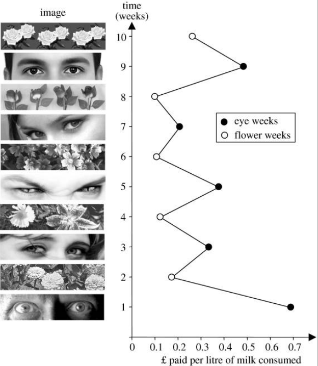

--- 
knit: "bookdown::render_book"
---

# Testes de hipóteses {#th}

```{r echo=FALSE}
set.seed(123)
```

## Vídeo 1

```{r echo=FALSE, results='asis', out.extra=center()}
embed_yt('jinX8qqzdxQ')
```


## Testes de hipóteses sobre a proporção

### Exemplo: proporção de bebês do sexo masculino { #ex1 }

::: {.rmdbox}

* Um [estudo de 1994 feito em Punjab, na Índia](https://www.bmj.com/content/309/6964/1259.full), relata que $56{,}9\%$ dos $550$ bebês nascidos em um ano em uma maternidade da região eram do sexo masculino.

* Segundo estudos anteriores, $51{,}7\%$ dos bebês nascidos por ano nessa região são meninos.

* Agora que a população tem acesso a exames que determinam o sexo do feto durante a gravidez, existem suspeitas de que fetos do sexo feminino estão sendo abortados pelos pais, por motivos culturais.

* A evidência é suficiente para afirmar que a proporção de bebês meninos na maternidade do estudo é maior do que a proporção da região? 

:::


#### Hipóteses {-}

* Um teste de hipóteses sempre vai ter [duas hipóteses]{.hl}.

* A primeira hipótese é a apresentada como "padrão". Esta é a hipótese que vai ser "desafiada". O nome técnico para esta hipótese é [hipótese de nulidade]{.hl}, ou [hipótese nula]{.hl}. [A hipótese de nulidade sempre envolve uma igualdade.]{.hl} e costuma ser chamada $H_0$. No exemplo,
  
  $$
  H_0 : p = 0{,}517
  $$
    
  Ou seja, a proporção de meninos nascidos na maternidade do estudo é de $51{,}7\%$, como no restante da região.
    
* A segunda hipótese, chamada [hipótese alternativa]{.hl}, contradiz de alguma maneira a hipótese de nulidade. No exemplo, vamos trabalhar com
  
  $$
  H_A : p > 0{,}517
  $$
    
  Ou seja, a verdadeira proporção de meninos nascidos na maternidade do estudo é maior que $51{,}7\%$.
  
  
#### Condições {-}

* O teste de hipóteses também se baseia no TCL. 

* Precisamos verificar as condições:

  1. [Independência:]{.hl} os sexos dos bebês são independentes entre si? Vamos supor que sim.
  
  1. [Amostra aleatória e representativa:]{.hl} a amostra são os $550$ bebês nascidos na maternidade em questão. Não vamos poder generalizar nossas conclusões para outras maternidades, nem outras regiões. Na verdade, [a população consiste em todos os bebês nascidos nessa maternidade, nesse e em outros anos.]{.hl} Vamos supor que os números desse ano são compatíveis com os números de outros anos.
  
  1. [Tamanho da amostra:]{.hl} temos mais do que $30$ elementos, e a amostra é menor do que $10\%$ da população.
  
  1. [Quantidades de sucessos e fracassos potenciais:]{.hl} considerando meninos como sucesso, a hipótese de nulidade diz que deveria haver $550 \times 0{,}517 = `r (550 * .517) %>% fm()`$ sucessos e $550 \times 0{,}483 = `r (550 * .483) %>% fm()`$ fracassos na amostra, mais do que os $10$ exigidos.
  

#### Valores {-}

```{r valores, echo=FALSE}
n <- 550
p_chapeu <- 0.569
p0 <- 0.517
ep <- sqrt(p0 * (1 - p0) / n)
```

* Tamanho da amostra: $n = 550$

* Proporção amostral: $\hat p = `r p_chapeu %>% fm()`$

* Hipótese de nulidade: $H_0 : p = 0{,}517$

* Hipótese alternativa: $H_A : p > 0{,}517$

* Nível de confiança: como com os intervalos de confiança, escolhemos $0{,}95$. Mas, em testes de hipóteses, trabalhamos com $1 - 0{,}95 = 0{,}05$ e chamamos este valor de [nível de significância, escrito $\alpha = 0{,}05$.]{.hl}


#### Estratégia {-}

* [Sempre começamos supondo que $H_0$ é verdadeira.]{.hl} No exemplo, isto significa supor que $p = 0{,}517$.

* Com isso, [construímos a distribuição amostral de $\hat p$, que vai ter como média o valor suposto de $p$.]{.hl}

* Usando esta distribuição amostral, [calculamos a probabilidade de obter uma amostra como a que obtivemos]{.hl} (com $\hat p = 0{,}569$) [ou mais extrema]{.hl} (com $\hat p > 0{,}569$).

* [A probabilidade calculada é chamada de valor $p$.]{.hl}

* [Se o valor $p$ for muito baixo]{.hl}, isto indica que, supondo $H_0$, [nossa amostra é muito improvável e serve como evidência contra $H_0$.]{.hl} Dizemos, então, que [rejeitamos $H_0$.]{.hl}

* Se o valor $p$ for alto, isto indica que, supondo $H_0$, nossa amostra não tem nada de inesperado, e não é evidência contra $H_0$. Não podemos rejeitar $H_0$.

* ["Baixo" ou "alto" são definidos em função do nível de significância $\alpha$.]{.hl}

  
#### A distribuição amostral de $\hat p$, supondo $H_0$ {-}

* Pelo TCL e supondo $H_0$, a distribuição amostral das proporções vai ser normal, com média $\mu = p = `r p0 %>% fm()`$ e erro-padrão

  $$
  \sigma_{\hat p} 
  = \sqrt{\frac{p(1-p)}{n}} 
  = `r ep %>% fm()`
  $$

* Graficamente:

    ```{r echo=FALSE}
    p_min <- (p0 - .1) %>% round(1) 
    p_max <- (p0 + .1) %>% round(1) 
    brks <- c(p_min, p0, p0 + .1, p_chapeu, p_max)
    
    ggplot() +
      stat_function(
        fun = dnorm,
        args = c(p0, ep),
        xlim = c(p_min, p_max)
      ) +
      stat_function(
        fun = dnorm,
        args = c(p0, ep),
        xlim = c(p_chapeu, p_max),
        fill = 'red',
        alpha = .5,
        geom = 'area'
      ) +
      scale_x_continuous(
        breaks = brks
      ) +
      labs(
        y = NULL
      )
    ```

#### O valor $p$ e a conclusão {-}

* O valor $p$ vai ser a probabilidade que corresponde à área em vermelho, que pode ser calculada em R:

    ```{r}
    <<valores>>
    valor_p <- pnorm(p_chapeu, mean = p0, sd = ep, lower.tail = FALSE)
    valor_p
    ```

* Este valor é muito menor do que $\alpha = 0{,}05$. [Logo, nossa amostra é evidência para rejeitar a hipótese de nulidade neste nível de significância]{.hl}. Concluímos que essa maternidade tem uma proporção de nascimentos de meninos maior do que $`r p0 %>% fm()`$, com $\alpha = 0{,}05$.

* Outros níveis de significância usados na prática são $\alpha = 0{,}1$ (menos exigente) e $\alpha = 0{,}01$ (mais exigente). Em algumas áreas, como na Física, são usados níveis de significância mais exigentes ainda, como $\alpha = 0{,}0000003$ no [experimento que confirmou a existência do bóson de Higgs](https://medium.com/@chris.m.pease/the-higgs-boson-and-5-sigma-eec238b43f93).


#### Em R {-}

```{r}
prop.test(
  x = p_chapeu * n,          # número de sucessos
  n = n,                     # tamanho da amostra
  p = p0,                    # valor de p na hipótese de nulidade
  alternative = 'greater',   # hipótese alternativa é p > p0
  conf.level = .95,          # 1 - α (o default já é .95)
  correct = FALSE            # sem correção de continuidade 
)
```


### Exemplo: percepção extra-sensorial { #ex2 }

::: {.rmdbox}

* Um suposto vidente alega que consegue detectar os naipes de cartas colocadas viradas para baixo, diante dele, em uma mesa.

* Em um experimento, um pesquisador apresenta ao suposto vidente $50$ cartas, escolhidas ao acaso dentre as cartas de $10$ baralhos, e o suposto vidente acerta o naipe de $10$ delas.

* O pesquisador diz ao suposto vidente que ele teve *menos* acertos do que se ele tivesse adivinhado ao acaso: $50 \times 1/4 = `r (50/4) %>% fm()`$.

* O suposto vidente diz que isso também é evidência dos seus poderes: os erros foram causados por "interferência", pois o suposto vidente estava captando informações sobre o naipe da carta, mas não conseguiu interpretá-las corretamente.

:::


#### Hipóteses {-}

* A [hipótese de nulidade]{.hl} diz que o suposto vidente não tem poderes; a verdadeira proporção de acertos sempre vai ser, a princípio, $1/4$ da quantidade de cartas:

  $$
  p = 0{,}25
  $$

* A [hipótese alternativa]{.hl} reflete os argumentos do suposto vidente de que uma proporção significativamente maior ou significativamente menor do que $25\%$ indica a existência de poderes extra-sensoriais:

  $$
  p \neq 0{,}25
  $$

* A hipótese alternativa, agora, vai gerar um [teste bilateral]{.hl}.


#### Condições {-}

1. [Independência:]{.hl} Vamos supor que acertar o naipe de uma carta independe de acertar o naipe de outra carta. Por exemplo, podemos supor que a dificuldade de acertar o naipe de uma carta é sempre a mesma, independente da carta, da ordem em que elas aparecem etc. O fato de que as $50$ cartas foram escolhidas dentre $10$ baralhos ($520$ cartas, no total) nos permite considerar que os naipes das cartas escolhidas são independentes. Além disso, se não quisermos que o suposto vidente "conte" os naipes das cartas durante o experimento, podemos decidir só revelar os naipes das $50$ cartas *depois* que o suposto vidente tiver registrado seus palpites.
  
1. [Amostra aleatória e representativa:]{.hl} A população é o conjunto de todas as cartas que poderiam ser escolhidas para o suposto vidente poder exercer seus poderes. As $50$ cartas, escolhidas ao acaso, representam de forma adequada esta população.
  
1. [Tamanho da amostra:]{.hl} temos mais do que $30$ elementos, e a amostra é menor do que $10\%$ da população (que é infinita).
  
1. [Quantidades de sucessos e fracassos potenciais:]{.hl} a hipótese de nulidade diz que deveria haver $50 \times 1/4 = `r (50/4) %>% fm()`$ sucessos e $50 \times 3/4 = `r (50 * 3/4) %>% fm()`$ fracassos na amostra, mais do que os $10$ exigidos.


#### Valores {-}

```{r valores-2, echo=FALSE}
sucessos <- 10
n <- 50
p0 <- 1/4
p_chapeu <- sucessos / n
ep <- sqrt(p0 * (1 - p0) / n)
p_cauda_direita <- p0 + (p0 - p_chapeu)
```

* Tamanho da amostra: $n = 50$

* Proporção amostral: $\hat p = `r p_chapeu %>% fm()`$

* Hipótese de nulidade: $H_0 : p = `r p0 %>% fm()`$

* Hipótese alternativa: $H_A : p \neq `r p0 %>% fm()`$

* Nível de significância: $\alpha = 0{,}05$


#### Estratégia {-}

* Começamos supondo que $H_0$ é verdadeira: $p = `r p0 %>% fm()`$.

* Com isso, construímos a distribuição amostral de $\hat p$, que vai ter como média o valor suposto de $p$.

* Usando esta distribuição amostral, calculamos a probabilidade de obter uma amostra como a que obtivemos ou mais extrema (mais distante de $`r p0 %>% fm()`$).

  
#### A distribuição amostral de $\hat p$, supondo $H_0$ {-}

* Pelo TCL e supondo $H_0$, a distribuição amostral das proporções vai ser normal, com média $\mu = p = `r p0 %>% fm()`$ e erro-padrão

  $$
  \sigma_{\hat p} 
  = \sqrt{\frac{p(1-p)}{n}} 
  = `r ep %>% fm()`
  $$

* Graficamente:

    ```{r echo=FALSE}
    p_min <- 0
    p_max <- .5
    brks <- c(p_min, p0, p_chapeu, p_cauda_direita, p_max)
    
    ggplot() +
      stat_function(
        fun = dnorm,
        args = c(p0, ep),
        xlim = c(p_min, p_max)
      ) +
      stat_function(
        fun = dnorm,
        args = c(p0, ep),
        xlim = c(p_min, p_chapeu),
        fill = 'red',
        alpha = .5,
        geom = 'area'
      ) +
      stat_function(
        fun = dnorm,
        args = c(p0, ep),
        xlim = c(p_cauda_direita, p_max),
        fill = 'red',
        alpha = .5,
        geom = 'area'
      ) +
      scale_x_continuous(
        breaks = brks
      ) +
      labs(
        y = NULL
      )
    ```

#### O valor $p$ e a conclusão {-}

* O valor $p$ vai ser a probabilidade que corresponde à área em vermelho, que pode ser calculada em R:

    ```{r}
    <<valores-2>>
    valor_p <- 
      pnorm(p_chapeu, mean = p0, sd = ep) +
      pnorm(p_cauda_direita, mean = p0, sd = ep, lower.tail = FALSE)
    valor_p
    ```

* Este valor é maior do que $\alpha = 0{,}05$. [Logo, nossa amostra não é evidência para rejeitar a hipótese de nulidade neste nível de significância]{.hl}. 


#### Em R {-}

```{r}
prop.test(
  x = sucessos,              # número de sucessos
  n = n,                     # tamanho da amostra
  p = p0,                    # valor de p na hipótese de nulidade
  alternative = 'two.sided', # hipótese alternativa é p != p0
  conf.level = .95,          # 1 - α (o default já é .95)
  correct = FALSE            # sem correção de continuidade 
)
```


### Erros, poder e tamanho do efeito

#### Rejeitar $\times$ não rejeitar {-}

* Em um teste de hipóteses, [nada é provado]{.hl}.

* Se o valor $p$ for [menor]{.hl} do que $\alpha$, você deve concluir que [existem evidências para rejeitar a hipótese de nulidade]{.hl}.

* Se o valor $p$ for [maior]{.hl} do que $\alpha$, você deve concluir que [não existem evidências para rejeitar a hipótese de nulidade]{.hl}.

* Seja como for, você deve incluir na sua conclusão

  * As hipóteses.
  
  * O valor da estatística envolvida no teste (aqui, a proporção amostral).
  
  * O tamanho da amostra.
  
  * O valor de $\alpha$.
  
  * O valor $p$.
  
  * A informação de se o teste é unilateral ou bilateral.

* Como nada é provado, [existe a possibilidade de acontecer um erro]{.hl}: 

  * Você pode [rejeitar $H_0$ quando ela é verdadeira]{.hl}, ou 
  
  * Você pode [não rejeitar $H_0$ quando ela é falsa.]{.hl}


#### Erro tipo 1: rejeitar quando não devíamos {-}

* Falso positivo.

* Diagnosticar como doente um paciente saudável.

* Condenar um réu inocente.

* [Um erro tipo $1$ só acontece quando a hipótese de nulidade é verdadeira.]{.hl}

* A probabilidade de um erro tipo $1$ acontecer é a probabilidade de a nossa amostra ser uma amostra "ruim".

* Mas a probabilidade de a amostra ser ruim é exatamente $\alpha$.

* Então, [a probabilidade de um erro tipo $1$ é sempre igual a $\alpha$.]{.hl}


#### Erro tipo 2: não rejeitar quando devíamos {-}

* Falso negativo.

* Diagnosticar como saudável um paciente doente.

* Absolver um réu culpado.

* [Um erro tipo $2$ só acontece quando a hipótese de nulidade é falsa.]{.hl}

* Qual a probabilidade de um erro tipo $2$ acontecer? Vamos chamar esta probabilidade de $\beta$.

* É difícil calcular $\beta$, porque a hipótese alternativa não fixa um valor para o parâmetro sendo testado; então, não sabemos qual distribuição amostral usar.

* A probabilidade $\beta$ de um erro tipo $2$ diminui à medida que $\alpha$ aumenta.

* Um $\alpha$ maior torna mais difícil rejeitar a hipótese de nulidade.


#### Poder de um teste {-}

* O "melhor" resultado do teste é [rejeitar $H_0$ quando ela é falsa]{.hl}.

* Isto acontece com probabilidade $1 - \beta$.

* Este é o [poder (ou potência)]{.hl} do teste: [a capacidade de detectar a diferença entre o valor do parâmetro em $H_0$ e o valor verdadeiro do parâmetro.]{.hl}

* Mas não é uma boa idéia aumentar $\alpha$ para aumentar o poder, pois isto aumenta a chance de um erro tipo $1$.

* A melhor maneira de diminuir $\alpha$ e $\beta$ ao mesmo tempo é [aumentando o tamanho da amostra.]{.hl}

* Podemos calcular o tamanho da amostra necessário para que o poder do teste tenha um certo valor, mas isto depende de mais informação.


#### O tamanho do efeito {-}

* Diferença entre o valor do parâmetro em $H_0$ e o valor verdadeiro do parâmetro.

* Efeitos maiores são mais fáceis de detectar.

* Efeitos menores são mais difíceis de detectar.

* [O poder de um teste também depende do tamanho do efeito.]{.hl}


#### Explorando tudo interativamente {-}

* https://rpsychologist.com/d3/nhst/


### Exercícios

#### Usando `binom.test` {-}

* No [exemplo dos bebês](#ex1), calcule a *quantidade* de nascimentos de meninos na amostra. O que há de estranho?

* A função `binom.test`, de R base, também faz teste de hipótese para a proporção (embora usando um algoritmo diferente do nosso). Rode o seguinte código:

    ```{r eval=FALSE}
    binom.test(
      x = p_chapeu * n,          # número de sucessos
      n = n,                     # tamanho da amostra
      p = p0,                    # valor de p na hipótese de nulidade
      alternative = 'greater',   # hipótese alternativa é p > p0
      conf.level = .95           # 1 - α
    )
    ```

  O que dá errado? Por quê? Como consertar?


#### Outro suposto vidente {-}

* O [experimento do exemplo](#ex2) é repetido com outra pessoa, que acerta o naipe de $17$ das $50$ cartas. Refaça o teste de hipóteses com este novo valor, de duas maneiras:

  1. Com um teste bilateral: $H_A : p \neq 0{,}25$.
  
  1. Com um teste unilateral: $H_A : p > 0{,}25$.

* Quais as suas conclusões?


## Vídeo 2

```{r echo=FALSE, results='asis', out.extra=center()}
embed_yt('Ajf5r4EIV6c')
```


## Testes de hipóteses sobre a média

### Exemplo: duração da gestação { #gest }

```{r valores0, echo=FALSE}
xbar <- 275
σ <- 10
n <- 25
ep <- σ / sqrt(n)
m0 <- 280
dif <- abs(m0 - xbar)
```

::: {.rmdbox}

* O tempo de gestação em seres humanos segue a distribuição normal, com média $\mu = `r m0`$ dias e desvio-padrão $\sigma = `r σ`$\ dias.

* Em uma amostra de $n = `r n`$ bebês nascidos em uma clínica, o tempo médio de gestação foi de $\bar x = `r xbar`$ dias.

* Esta amostra é evidência de que a duração média da gestação humana é *diferente de* $`r m0`$ dias?

:::

#### Hipóteses {-}

* A hipótese de nulidade diz que a duração média da gestação é de $`r m0`$ dias:

  $$
  H_0 : \mu = `r m0`
  $$

* A hipótese alternativa diz que duração média da gestação é diferente de $`r m0`$ dias:

  $$
  H_A : \mu \neq `r m0`
  $$


#### Condições {-}

* Verifique que as condições de independência, aleatoriedade, representatividade e tamanho da amostra são satisfeitas.

* Como a distribuição da população é normal, podemos aceitar $n = `r n`$.


#### Valores {-}

* Tamanho da amostra: $n = `r n`$

* Média amostral: $\bar x = `r xbar`$

* Hipótese de nulidade: $H_0 : \mu = `r m0`$

* Hipótese alternativa: $H_A : \mu \neq `r m0`$

* Nível de significância: $\alpha = 0{,}05$


#### O valor $p$ e a conclusão {-}

* Como a hipótese alternativa envolve "$\neq$", [o teste é bilateral]{.hl}.

* [Já sabemos $\sigma$ (o desvio-padrão populacional)]{.hl}. Não precisamos do desvio-padrão amostral.
* [A distribuição amostral vai ser a normal]{.hl} com média $\mu = `r m0`$ e desvio-padrão

  $$
  EP = \frac{\sigma}{\sqrt{n}} = \frac{`r σ`}{\sqrt{`r n`}} = `r ep`
  $$


* Usando esta distribuição amostral, calculamos a probabilidade de obter uma amostra como a que obtivemos (com a média amostral $`r dif`$ dias [menor ou maior]{.hl} que a média suposta por $H_0$) ou mais extrema.

* O valor $p$ vai ser esta probabilidade.

    ```{r graf-gest, echo=FALSE}
    m_min <- 270
    m_max <- 290
    m_direita <- m0 + (m0 - xbar)
    
    brks <- c(m_min, xbar, m0, m_direita, m_max)
    
    ggplot() +
      stat_function(
        fun = dnorm,
        args = c(m0, ep),
        xlim = c(m_min, m_max)
      ) +
      stat_function(
        fun = dnorm,
        args = c(m0, ep),
        xlim = c(m_min, xbar),
        fill = 'red',
        alpha = .5,
        geom = 'area'
      ) +
      stat_function(
        fun = dnorm,
        args = c(m0, ep),
        xlim = c(m_direita, m_max),
        fill = 'red',
        alpha = .5,
        geom = 'area'
      ) +
      scale_x_continuous(
        breaks = brks
      ) +
      labs(
        y = NULL
      )
    ```

* Calculando em R:

    ```{r}
    <<valores0>>
    valor_p <- pnorm(xbar, m0, ep) +
      pnorm(m0 + dif, m0, ep, lower.tail = FALSE)
    valor_p
    ```

* Este valor é menor do que $\alpha = 0{,}05$. [Logo, nossa amostra é evidência para rejeitar a hipótese de nulidade neste nível de significância]{.hl}. 

* Pode parecer surpreendente que $`r dif`$ dias façam tanta diferença assim. O problema é que o desvio-padrão da população é relativamente baixo: $`r σ`$ dias. A variação é pequena. Por isso a diferença entre a média amostral e a média afirmada em $H_0$ é significativa.

* Visto de outro modo: como $\sigma$ é um valor pequeno, o erro-padrão (i.e., o desvio-padrão da distribuição amostral) também é pequeno; a distribuição amostral, vista na figura acima, é bem estreita, com boa parte da probabilidade bem próxima da média.


#### Em R {-}

* Vamos carregar um pacote que implementa o teste z:

    ```{r message=FALSE}
    library(BSDA)
    ```

* Esta função recebe o resumo (*summary*) da amostra:

    ```{r ztest}
    zsum.test(
      mean.x = xbar, 
      sigma.x = σ, 
      n.x = n,
      alternative = 'two.sided',
      mu = m0
    )
    ```


### Exemplo: salmões novamente

```{r echo=FALSE, message=FALSE}
salmoes <- read_csv('data/Farmed_Salmon.csv') %>% 
  select(location = Location, mirex = Mirex) %>% 
  filter(!is.na(mirex))
```

```{r valores1, echo=FALSE}
xbar <- mean(salmoes$mirex)
s <- sd(salmoes$mirex)
n <- length(salmoes$mirex)
ep <- s / sqrt(n)
m0 <- 0.08
t0 <- (xbar - m0) / ep
```

::: {.rmdbox}

* Numa amostra de $150$ salmões, foi medida a concentração do contaminante [*mirex*](https://en.wikipedia.org/wiki/Mirex), um inseticida banido pela [Convenção de Estocolmo](https://pt.wikipedia.org/wiki/Conven%C3%A7%C3%A3o_de_Estocolmo).

* As concentrações (em ppm) estão resumidas na tabela abaixo.

  ```{r echo=FALSE}
  salmoes
  ```

* A média foi $\overline x = `r xbar`$ppm.

* O desvio-padrão *amostral* foi $s = `r s`$ppm.

* Não sabemos o desvio-padrão *populacional*.

* Alguém nos diz que a concentração máxima de mirex permitida é de $`r m0`$ppm.

* Esta amostra é evidência de que a concentração máxima foi ultrapassada?

:::


#### Hipóteses {-}

* A hipótese de nulidade diz que a concentração é a máxima permitida ou menor:

  $$
  H_0 : \mu \leq `r m0`
  $$

* A hipótese alternativa diz que a concentração máxima foi ultrapassada:

  $$
  H_A : \mu > `r m0`
  $$


#### Condições {-}

* Verifique que as condições de independência, aleatoriedade, representatividade e tamanho da amostra são satisfeitas.

* Se precisar, reveja o vídeo sobre intervalos de confiança para a média, onde este exemplo também aparece.


#### Valores {-}

* Tamanho da amostra: $n = `r n`$

* Média amostral: $\bar x = `r xbar`$

* Hipótese de nulidade: $H_0 : \mu \leq `r m0`$

* Hipótese alternativa: $H_A : \mu > `r m0`$

* Nível de significância: $\alpha = 0{,}05$


#### O valor $p$ e a conclusão {-}

* Como não sabemos $\sigma$ (o desvio-padrão populacional), [vamos usar $s$ (o desvio-padrão amostral)]{.hl}.

* Com isto, [a distribuição amostral das médias será a distribuição $t$]{.hl}, com $n - 1 = `r n - 1`$ graus de liberdade.

* Mas, [como a distribuição $t$ tem média $0$, precisamos padronizar a nossa média amostral]{.hl}: subtrair a média que $H_0$ diz ser a verdadeira ($\mu_0 = `r m0`$) e dividir pelo erro-padrão:

  $$
  t_0 = \frac{\bar x - \mu_0}{EP}
  $$

* O erro-padrão, como vimos nas aulas sobre intervalos de confiança, é 

  $$
  EP = \frac{s}{\sqrt{n}} = \frac{`r s`}{\sqrt{`r n`}} = `r ep`
  $$

* Isto nos dá

  $$
  t_0 = \frac{\bar x - \mu_0}{EP} = \frac{`r xbar` - `r m0`}{`r ep`} = `r t0`
  $$

* Como a hipótese alternativa envolve "$>$" e não "$\neq$", [o teste é unilateral]{.hl}.

* O valor $p$ é a probabilidade de a [média amostral padronizada]{.hl} ser maior do que $t_0$:

    ```{r echo=FALSE}
    brks <- c(seq(-4, 4, 2), t0 %>% round(3))
    xmin <- -4
    xmax <- 4
    
    ggplot() +
      stat_function(
        fun = dt,
        args = n - 1,
        xlim = c(xmin, xmax)
      ) +
      stat_function(
        fun = dt,
        args = n - 1,
        xlim = c(t0, xmax),
        fill = 'red',
        alpha = .5,
        geom = 'area'
      ) +
      scale_x_continuous(
        breaks = brks
      ) +
      labs(
        y = NULL
      )
    ```

* Este valor pode ser calculado em R (os valores da amostra estão em `salmoes$mirex`):

    ```{r}
    <<valores1>>
    valor_p <- pt(t0, n - 1, lower.tail = FALSE)
    valor_p
    ```

* Conclusão: [como o valor $p$ é menor do que $\alpha$, rejeitamos a hipótese de nulidade.]{.hl} Com este nível de significância, a amostra é evidência de que a contaminação é maior do que a permitida.


#### Em R {-}

```{r}
t.test(
  salmoes$mirex, 
  alternative = 'greater',
  mu = m0
)
```


### Relação entre testes e IC

* Intervalos de confiança e testes de hipóteses são [duas maneiras de enxergar a mesma inferência]{.hl}.

* Lembre-se do [exemplo sobre o tempo de gestação](#gest):

    ```{r echo=FALSE}
    <<valores0>>
    <<graf-gest>>
    ```

    ```{r}
    zt <- zsum.test(
      mean.x = xbar, 
      sigma.x = σ, 
      n.x = n,
      alternative = 'two.sided',
      mu = m0
    )
    
    zt
    ```

    ```{r echo=FALSE}
    ic <- zt$conf.int[1:2]
    ```

* Mantenha fixa a nossa amostra de $`r n`$ gestações.

* A hipótese de nulidade [foi rejeitada]{.hl} com $\alpha = 0{,}05$ porque o valor que ela "defendia" ($`r m0`$) estava [fora do intervalo de confiança]{.hl} de $1 - \alpha = 0{,}95$.

* Reciprocamente, mantendo $\alpha = 0{,}05$, qualquer hipótese de nulidade que [não for rejeitada]{.hl} vai "defender" um valor [dentro do intervalo de confiança]{.hl} (entre $`r ic[1]`$ e $`r ic[2]`$).

* Experimente rodar a função `zsum.test` com diferentes valores de `mu` para verificar que isto acontece.


### Explorando tudo interativamente (com outro app)

* https://rpsychologist.com/pvalue/


### Exercícios

#### Gestação {-}

* No [exemplo](#gest), mude a hipótese alternativa para

  $$
  H_A : \mu < `r m0`?
  $$

  * Sem refazer os cálculos, você consegue dizer qual é o novo valor $p$? Compare-o com o valor $p$ original.
  
  * A hipótese de nulidade continuaria sendo rejeitada?

  * O que mudaria na chamada da função `zsum.test`?
  

#### Salmões {-}

* Qual seria o valor $p$ se a média amostral tivesse sido $0{,}08$ppm?

* Qual seria o valor $p$ se as hipóteses fossem

  $$
  \begin{align*}
  H_0 &: \mu = 0{,}08 \\
  H_A &: \mu \neq 0{,}08 
  \end{align*}
  $$

  e a média amostral tivesse sido $0{,}08$ppm?

* Quando o valor $p$ é $0$?


#### Testes e IC {-}

* O que acontece com o intervalo de confiança quando o teste de hipótese é unilateral?

* Já que intervalos de confiança e testes de hipóteses contêm a mesma informação, qual dos dois procedimentos você acha mais intuitivo? Mais fácil de executar? Mais fácil de apresentar a um leigo?


#### App {-}

* Entre em https://rpsychologist.com/pvalue/

* No "painel de controle", deixe `sample dist. statistic` (estatística da distribuição amostral) em `Mean` (média). Com isto, a curva de baixo vai mostrar a distribuição amostral das médias.

* Qual o efeito, sobre a distribuição amostral, de aumentar o tamanho da amostra? Por quê?

* Defina o tamanho da amostra como $9$.

* O app está configurado para o seguinte teste:

  $$
  \begin{align*}
  H_0 &: \mu = 100 \\
  H_A &: \mu \neq 100 
  \end{align*}
  $$

* [Primeira situação: a hipótese de nulidade é verdadeira.]{.hl}

  1. Faça o que você deve fazer para que, no app, $H_0$ seja verdadeira.  
     Dica: a distribuição populacional "verdadeira" é representada pela curva de cima.
  
  1. Retire $200$ amostras de $9$ elementos cada, apertando quatro vezes o botão `+50`.
  
  1. Quantas das $200$ bolinhas são azuis? O que elas significam em termos de médias amostrais? Qual a relação delas com $\alpha$?
  
  1. Mude `sample dist. statistic` para `Z`. 
  
  1. O que significam os novos rótulos no eixo horizontal da distribuição amostral?
  
  1. O que significam as linhas pontilhadas verticais? Em que valores do eixo horizontal elas estão?
  
  1. Se o app nos deixasse mudar essas linhas pontilhadas de posição (o app não deixa), o que isto significaria?
  
  1. Mude `sample dist. statistic` para `p-value`. Agora, as $200$ amostras aparecem distribuídas de acordo com seus valores $p$.
  
  1. O que significam as bolinhas azuis?
  
  1. O que significam as bolinhas vermelhas?
  
  1. Com $H_0$ verdadeira, como os valores $p$ das $200$ amostras estão distribuídos?
  
* [Segunda situação: a hipótese de nulidade é falsa.]{.hl}

  1. Apague as amostras, clicando em `CLEAR`.

  1. Mude `sample dist. statistic` para `mean`. 
  
  1. Defina o tamanho da amostra como $9$.

  1. Faça o que você deve fazer para que a média populacional passe a ser [aproximadamente $110$]{.hl}, tornando $H_0$ falsa.

  1. Retire $200$ amostras de $9$ elementos cada, apertando quatro vezes o botão `+50`.
  
  1. Qual fração aproximada das $200$ bolinhas são azuis? O que elas significam em termos de médias amostrais? Qual a relação delas com $1 - \beta$ (a potência)?
  
  1. Você pode alterar o tamanho das amostras agora, e o app vai atualizar as figuras magicamente. Qual deve ser o valor de $n$ para que a potência ultrapasse $0{,}8$?

  1. Mude `sample dist. statistic` para `p-value`.
  
  1. O que significam as bolinhas azuis?
  
  1. O que significam as bolinhas vermelhas?
  
  1. Com $H_0$ falsa, como os valores $p$ das $200$ amostras estão distribuídos?
  
* [Terceira situação: a hipótese de nulidade é falsa, mas não muito.]{.hl}

  1. Apague as amostras, clicando em `CLEAR`.

  1. Faça o que você deve fazer para que a média populacional passe a ser [aproximadamente $105$]{.hl}, tornando $H_0$ falsa, mas com uma diferença menor para a média verdadeira.
  
  1. Refaça os passos restantes da segunda situação.
  
  1. Comente os resultados.

* [Quarta situação: a hipótese de nulidade é falsa, e muito.]{.hl}

  1. Apague as amostras, clicando em `CLEAR`.

  1. Faça o que você deve fazer para que a média populacional passe a ser [aproximadamente $120$]{.hl}, tornando $H_0$ falsa, com uma diferença muito grande para a média verdadeira.
  
  1. Refaça os passos restantes da segunda situação.
  
  1. Comente os resultados.

  
* **Desafio:** 

  * A curva da parte superior da página, de onde "pingam" as médias amostrais, é uma distribuição normal. 
  
  * Durante os exercícios acima, você descobriu como alterar a média dessa normal.
  
  * Você consegue calcular o desvio-padrão dessa normal?  
    Dica: considere a fórmula que dá o erro-padrão da distribuição amostral (a curva de baixo).


## Vídeo 3

```{r echo=FALSE, results='asis', out.extra=center()}
embed_yt('83pzxnP-p6s')
```


## Testes de hipóteses com duas amostras

### Diferença entre proporções

#### Exemplo: jovens *online* {-}

::: {.rmdbox}

Duas amostras: 

* $141$ de $248$ rapazes com idades entre $15$ e $17$ anos possuem um perfil *online*.

* $179$ de $256$ meninas com idades entre $15$ e $17$ anos possuem um perfil *online*.

A diferença entre as proporções é significativa?

:::

##### Condições {-}

* As [mesmas condições de testes com uma amostra]{.hl} precisam ser verificadas:

  * Independência.
  
  * Amostras aleatórias e representativas.
  
  * Tamanho da amostra menor que $10\%$ da população.
  
* [E mais:]{.hl}
  
  * Independência dos grupos.
  
  * Cada grupo deve ter no mínimo $10$ sucessos e $10$ fracassos.
  
##### Hipóteses {-}  

* O teste, agora, é sobre a [diferença]{.hl} entre as proporções:

  $$
  H_0 : p_h - p_m = 0 \\
  H_A : p_h - p_m \neq 0
  $$

##### Erro padrão {-}

* A diferença $p_h - p_m$ é uma variável aleatória.

* A variância da diferença é a soma das variâncias:

  $$
  \sigma^2_{p_h - p_m} = \sigma^2_{p_h} + \sigma^2_{p_m}
  $$

* A variância da proporção [amostral]{.hl} é

  $$
  \sigma^2(\hat p) = \frac{p(1 - p)}{n}
  $$

* Logo, a variância da diferença $p_h - p_m$ será

  $$
  \sigma^2(\hat p_h - \hat p_m) 
  = \frac{p_h(1 - p_h)}{n_h} + \frac{p_m(1 - p_m)}{n_m}
  $$

* Daí, o desvio-padrão da distribuição amostral da diferença é

  $$
  \sigma(\hat p_h - \hat p_m) 
  = \sqrt{\frac{p_h(1 - p_h)}{n_h} + \frac{p_m(1 - p_m)}{n_m}}
  $$

* Como não sabemos os valores verdadeiros de $p_h$ e $p_m$, usamos as proporções amostrais para obter o erro-padrão:

  $$
  EP(\hat p_h - \hat p_m) 
  = \sqrt{\frac{\hat p_h(1 - \hat p_h)}{n_h} + \frac{\hat p_m(1 - \hat p_m)}{n_m}}
  $$

* [Se fôssemos construir um intervalo de confiança]{.hl}, usaríamos este erro-padrão.

* Mas, em um teste de hipóteses, [estamos supondo que $H_0$ é verdadeira, o que equivale a dizer que $p_h = p_m$.]{.hl}

* Então, podemos calcular uma [proporção ponderada, ou agregada:]{.hl}

  $$
  \bar p = \frac{\text{sucessos}_h + \text{sucessos}_m}{n_h + n_m}
  $$

* Aí, [calculamos o erro-padrão com este valor]{.hl} em vez de $\hat p_h$ e $\hat p_m$:
  
  $$
  EP(\hat p_h - \hat p_m) 
  = \sqrt{\frac{\bar p(1 - \bar p)}{n_h} + \frac{\bar p(1 - \bar p)}{n_m}}
  $$


##### Valores {-}

* Tamanhos das amostras: $n_h = 248$ e $n_m = 256$.

* Proporções amostrais: $\hat p_h = 0{,}57$ e $\hat p_m = 0{,}7$.

* Hipótese de nulidade: $H_0 : p_h - p_m = 0$.

* Hipótese alternativa: $H_A : p_h - p_m \neq 0$.

* Nível de significância: $\alpha = 0{,}05$.


##### Cálculos {-}

```{r}
n_h <- 248
sucessos_h <- 141
p_h <- sucessos_h / n_h

n_m <- 256
sucessos_m <- 179
p_m <- sucessos_m / n_m

d0 <- 0
d_chapeu <- p_m - p_h 
d_cauda_esquerda <- d0 - (d_chapeu - d0)

p_agregado <- (sucessos_h + sucessos_m) / (n_h + n_m)

ep <- sqrt(
  p_agregado * (1 - p_agregado) / n_h + 
  p_agregado * (1 - p_agregado) / n_m
)

ep
```

##### A distribuição amostral de $\hat p_h - \hat p_m$, supondo $H_0$ {-}

```{r echo=FALSE}
d_min <- -.15
d_max <- .15

brks <- c(d_min, d_cauda_esquerda, d0, d_chapeu, d_max) %>% round(2)

ggplot() +
  stat_function(
    fun = dnorm,
    args = c(d0, ep),
    xlim = c(d_min, d_max)
  ) +
  stat_function(
    fun = dnorm,
    args = c(d0, ep),
    xlim = c(d_min, d_cauda_esquerda),
    fill = 'red',
    alpha = .5,
    geom = 'area'
  ) +
  stat_function(
    fun = dnorm,
    args = c(d0, ep),
    xlim = c(d_chapeu, d_max),
    fill = 'red',
    alpha = .5,
    geom = 'area'
  ) +
  scale_x_continuous(
    breaks = brks
  ) +
  labs(
    y = NULL
  )
```

##### Valor $p$ e conclusão {-}

```{r}
valor_p <- 
  pnorm(d_cauda_esquerda, mean = d0, sd = ep) +
  pnorm(d_chapeu, mean = d0, sd = ep, lower.tail = FALSE)
valor_p
```

* Este valor é [menor]{.hl} do que $\alpha = 0{,}05$. Logo, nossa amostra é evidência para [rejeitar]{.hl} a hipótese de nulidade neste nível de significância.


#### Em R {-}

```{r}
prop.test(
  x = c(sucessos_m, sucessos_h),
  n = c(n_m, n_h),
  alternative = 'two.sided',
  correct = FALSE
)
```


### Diferença entre médias (amostras independentes)

#### Exemplo: olhos $\times$ flores {-}

::: {.rmdbox}

* Em $2006$, pesquisadores em uma universidade inglesa fizeram um experimento para verificar se as pessoas alteram seu comportamento quando se sentem vigiadas. 

* Na universidade, havia uma copa onde chá, café e leite eram disponibilizados para todos que frequentavam o local.

* Na parede, próximo às bebidas, ficava um cartaz com as instruções para pagamento e os valores de cada bebida. As pessoas deviam depositar o dinheiro em uma caixa próxima às bebidas.

* Junto a esse cartaz, os pesquisadores afixaram outro, com imagens.

* As imagens eram trocadas regularmente. Durante uma semana, eram flores; durante uma semana, era um par de olhos. Esta alternância foi mantida durante $10$ semanas.

* A disposição da copa era tal que, se alguém decidisse não pagar, ninguém perceberia.

* Os pesquisadores controlaram a arrecadação por litro de leite consumido por semana.

* Em média, esta arrecadação foi quase $3$ vezes maior nas semanas em que o cartaz continha o par de olhos, em comparação com as semanas em que o cartaz continha as flores:

{ style='width: 50%;' .center }

* Este exemplo é baseado em https://www.ncbi.nlm.nih.gov/pmc/articles/PMC1686213/, de onde foi retirada a imagem acima.

:::


##### Amostras {-}

* As $5$ semanas com os cartazes dos olhos formam uma amostra.

* Nessas semanas, a arrecadação média por litro de leite foi de $0{,}417$ libras, com desvio-padrão de $0{,}1811$.

* As $5$ semanas com os cartazes das flores formam a outra amostra.

* Nessas semanas, a arrecadação média por litro de leite foi de $0{,}151$ libras, com desvio-padrão de $0{,}067$.

* Em R:

    ```{r}
    amostra_1 <- c(0.6843, 0.3038, 0.3780, 0.2202, 0.4987)
    amostra_2 <- c(0.1737, 0.117, 0.1075, 0.0981, 0.2587)
    ```


##### Condições {-}

* [Independência:]{.hl} vamos supor que as contribuições de uma pessoa são independentes das das outras.

* [Amostras aleatórias e representativas:]{.hl} vamos supor que essas contribuições representam a população de interesse (contribuições de frequentadores e funcionários da universidade? de todos os cidadãos ingleses? de toda a humanidade?)

* [Tamanho das amostras:]{.hl}

  * As amostras são menos do que $10\%$ da população.
  
  * As amostras são pequenas ($n_1 = n_2 = 5$). Precisamos ser cautelosos quanto às conclusões.
  
* [Independência dos grupos:]{.hl} o comportamento das pessoas nas semanas dos olhos é independente do comportamento *das mesmas pessoas* nas semanas das flores? Vamos supor que sim, embora esta seja uma suposição arriscada.

* [Dados aproximadamente normais:]{.hl} com amostras tão pequenas, é difícil avaliar. 

  * Para as semanas dos olhos:

    ```{r echo=FALSE}
    amostra_1 %>% 
      as_tibble() %>% 
      ggplot(aes(value)) +
        geom_histogram(bins = 4) +
        scale_y_continuous(breaks = 0:2) + 
        labs(
          y = NULL,
          x = 'arrecadação'
        )
    ```

  * Para as semanas das flores:

    ```{r echo=FALSE}
    amostra_2 %>% 
      as_tibble() %>% 
      ggplot(aes(value)) +
        geom_histogram(bins = 3) +
        labs(
          y = NULL,
          x = 'arrecadação'
        )
    ```

  * Agregando as duas amostras:

    ```{r echo=FALSE}
    c(amostra_1, amostra_2) %>% 
      as_tibble() %>% 
      ggplot(aes(value)) +
        geom_histogram(bins = 3) +
        labs(
          y = NULL,
          x = 'arrecadação'
        )
    ```

  * Pelo menos o terceiro histograma (com a união das duas amostras) é unimodal e simétrico. Vamos prosseguir com cautela.


##### Hipóteses {-}

* O teste, agora, é sobre a [diferença entre as médias]{.hl}:

  $$
  H_0 : \mu_1 - \mu_2 = 0 \\
  H_A : \mu_1 - \mu_2 \neq 0
  $$

  onde $\mu_1$ é a média da arrecadação nas semanas dos olhos, e $\mu_2$ é a média da arrecadação nas semanas das flores.


##### Erro padrão (variâncias diferentes) {-}

* Mesmo quando supomos $H_0$ --- i.e., que as médias [populacionais]{.hl} $\mu_1$ e $\mu_2$ são iguais --- não podemos afirmar nada sobre os desvios-padrão das duas [subpopulações]{.hl}: as semanas dos olhos e as semanas das flores.

* Podemos estimar as variações das duas amostras criando um *boxplot*:

    ```{r echo=FALSE}
    tibble(
      valor = c(amostra_1, amostra_2),
      amostra = factor(
        rep(c(1, 2), c(length(amostra_1), length(amostra_2)))
      )
    ) %>% 
      ggplot() +
        geom_boxplot(aes(group = amostra, y = valor, fill = amostra)) +
        scale_x_continuous(breaks = NULL) +
        scale_y_continuous(limits = c(0, NA)) +
        labs(
          x = NULL,
          y = NULL
        )
    ```

  A amostra $1$ parece ter uma variação maior do que a amostra $2$.
  
* De fato, o desvio-padrão da amostra $1$ é quase o triplo do da amostra $2$.

    ```{r}
    sd(amostra_1)
    sd(amostra_2)
    ```

* Então, estimamos a variância das semanas dos olhos por

  $$
  \hat \sigma^2_1 = \frac{s^2_1}{n_1}
  $$

  e estimamos a variância das semanas das flores por

  $$
  \hat \sigma^2_2 = \frac{s^2_2}{n_2}
  $$

* Daí, supondo $H_0$, a estimativa da variância populacional é

  $$
  \hat \sigma^2 = \frac{s^2_1}{n_1} + \frac{s^2_2}{n_2}
  $$

* E o erro-padrão será

  $$
  EP = \sqrt{\frac{s^2_1}{n_1} + \frac{s^2_2}{n_2}}
  $$


##### Valores {-}

* Tamanhos das amostras: $n_1 = n_2 = 5$.

* Médias amostrais: $\bar x_1 = 0{,}417$ e $\bar x_2 = 0{,}151$.

* desvios-padrão amostrais: $s_1 = 0{,}1811$ e $s_2 = 0{,}067$.

* Hipótese de nulidade: $H_0 : \mu_1 - \mu_2 = 0$.

* Hipótese alternativa: $H_A : \mu_1 - \mu_2 \neq 0$.

* Nível de significância: $\alpha = 0{,}05$.


##### Cálculos {-}

```{r}
n_1 <- length(amostra_1)
xbarra_1 <- mean(amostra_1)
s_1 <- sd(amostra_1)

n_2 <- length(amostra_2)
xbarra_2 <- mean(amostra_2)
s_2 <- sd(amostra_2)

d0 <- 0
dx <- xbarra_1 - xbarra_2
d_cauda_esquerda <- d0 - dx
  
ep <- sqrt(s_1^2 / n_1 + s_2^2 / n_2)
ep
```


##### A distribuição amostral de $\bar x_1 - \bar x_2$, supondo $H_0$ {-}

* Como não sabemos o desvio-padrão [populacional]{.hl}, precisamos usar a distribuição $t$.

* A média da distribuição $t$ é $0$. Precisamos padronizar os valores:

    ```{r}
    dx
    ```

    ```{r}
    tx <- (dx - d0)/ep
    tx
    ```

    ```{r}
    t_cauda_esquerda <- (d_cauda_esquerda - d0)/ep
    ```

* Quantos graus de liberdade?

  O número de graus de liberdade é dado por
  
  $$
  \nu = \frac{
    \left( \frac{s_1^2}{n_1} + \frac{s_2^2}{n_2} \right)^2
  }{
    \frac{(s_1^2 / n_1)^2}{n_1 - 1} +
    \frac{(s_2^2 / n_2)^2}{n_2 - 1}
  }
  $$

    ```{r}
    gl <- (s_1^2 / n_1 + s_2^2 / n_2)^2 / (
      (s_1^2 / n_1)^2 / (n_1 - 1) +
      (s_2^2 / n_2)^2 / (n_2 - 1)
    )
    
    gl
    ```

* Graficamente:

    ```{r echo=FALSE}
    d_min <- -5
    d_max <- 5
    
    brks <- c(d_min, t_cauda_esquerda, 0, tx, d_max) %>% round(2)
    
    ggplot() +
      stat_function(
        fun = dt,
        args = gl,
        xlim = c(d_min, d_max)
      ) +
      stat_function(
        fun = dt,
        args = gl,
        xlim = c(d_min, t_cauda_esquerda),
        fill = 'red',
        alpha = .5,
        geom = 'area'
      ) +
      stat_function(
        fun = dt,
        args = gl,
        xlim = c(tx, d_max),
        fill = 'red',
        alpha = .5,
        geom = 'area'
      ) +
      scale_x_continuous(
        breaks = brks
      ) +
      labs(
        y = NULL
      )
    ```


##### Valor $p$ e conclusão {-}

```{r}
valor_p <- 
  pt(t_cauda_esquerda, gl) +
  pt(tx, gl, lower.tail = FALSE)

valor_p
```

* Este valor é [menor]{.hl} do que $\alpha = 0{,}05$. Logo, nossa amostra é evidência para [rejeitar]{.hl} a hipótese de nulidade neste nível de significância.


#### Em R {-}

```{r}
t.test(amostra_1, amostra_2)
```

#### E se as arrecadações médias tiverem o mesmo $\sigma$? {-}

* O cálculo do erro-padrão muda.

* A variância agregada é

  $$
  s^2 = \frac{(n_1 - 1)s_1^2}{(n_1 + n_2 - 2)} + 
    \frac{(n_2 - 1)s_2^2}{(n_1 + n_2 - 2)}
  $$
  
* O erro-padrão fica

  $$
  EP = \sqrt{\frac{s^2}{n_1} + \frac{s^2}{n_2}}
  $$
  
  onde $s^2$ é a variância agregada, calculada acima.
  
    ```{r}
    var_agregada <- (
      (n_1 - 1) * var(amostra_1) + (n_2 - 1) * var(amostra_2)
    ) / (n_1 + n_2 - 2)
    
    ep <- sqrt(var_agregada / n_1 + var_agregada / n_2)
    ep
    ```

* O número de graus de liberdade fica mais simples:

    ```{r}
    gl <- n_1 + n_2 - 2
    gl
    ```

* Refazendo os cálculos:

    ```{r}
    tx <- (dx - d0)/ep
    tx
    ```

    ```{r}
    t_cauda_esquerda <- (d_cauda_esquerda - d0)/ep
    
    valor_p <- 
      pt(t_cauda_esquerda, gl) +
      pt(tx, gl, lower.tail = FALSE)
    
    valor_p
    ```

* Supondo o mesmo desvio-padrão para as duas subpopulações, o valor $p$ fica ainda menor. Como o valor é [menor]{.hl} do que $\alpha = 0{,}05$, nossa amostra é evidência para [rejeitar]{.hl} a hipótese de nulidade neste nível de significância.

* Em R:

    ```{r}
    t.test(amostra_1, amostra_2, var.equal = TRUE)
    ```


### Diferença entre médias (amostras pareadas)

#### Exemplo: quilometragem {-}

```{r echo=FALSE}
  df <- tibble(
    motorista = 1:11,
    dias_5 = c(2798, 7724, 7505,  838, 4592, 8107, 1228, 8718, 1097, 8089, 3807),
    dias_4 = c(2914, 6112, 6177, 1102, 3281, 4997, 1695, 6606, 1063, 6392, 3362),
    diferença = dias_5 - dias_4
  )
```

::: {.rmdbox}

* Durante um ano, um órgão público mediu a quilometragem total de seus $11$ motoristas em um regime de trabalho de $5$ dias por semana.

* No ano seguinte, os mesmos $11$ motoristas trabalharam $4$ dias por semana, e as quilometragens totais foram medidas novamente.

* Os resultados foram:

  ```{r echo=FALSE}
  df
  ```

* A diferença nas quilometragens foi significativa?

* Exemplo baseado em https://www.thefreelibrary.com/Four-day+work+week+improves+environment.-a019280161

:::

* As amostras agora são [pareadas]{.hl}.

* O que nos interessa é a diferença na quilometragem [de cada motorista]{.hl}.

* Vamos fazer um [teste $t$ sobre as diferenças]{.hl} (os valores da última coluna).


##### Condições {-}

* [Independência entre os pares:]{.hl} o comportamento de cada motorista independe do comportamento dos outros.

* [Amostras aleatórias e representativas:]{.hl} vamos supor que sim.

* [Tamanho das amostras:]{.hl} as amostras são menos do que $10\%$ da população.
  
* [Dados aproximadamente normais:]{.hl} vejamos um histograma das diferenças:

    ```{r echo=FALSE}
    df %>% 
      ggplot(aes(diferença)) +
        geom_histogram(breaks = seq(-2000, 4000, 2000)) +
        labs(y = NULL)
    ```


##### Hipóteses {-}

* O teste, agora, é sobre a [média das diferenças]{.hl}:

  $$
  H_0 : \mu_d = 0 \\
  H_A : \mu_d \neq 0
  $$


##### Erro padrão {-}

* Como o erro-padrão de $\mu$, mas, aqui, [$n$ é o número de pares.]{.hl}

  $$
  EP = \frac{s_d}{\sqrt n}
  $$

  onde $s_d$ é o desvio-padrão das diferenças.
  

##### Valores {-}

* Tamanho da amostra: $n = 11$.

* Média amostral: $\bar d = `r mean(df$diferença)`$.

* desvio-padrão amostral: $s_d = `r sd(df$diferença)`$.

* Hipótese de nulidade: $H_0 : \mu_d = 0$.

* Hipótese alternativa: $H_A : \mu_d \neq 0$.

* Nível de significância: $\alpha = 0{,}05$.


##### Cálculos {-}

```{r}
n <- length(df$diferença)
d_barra <- mean(df$diferença)
s_d <- sd(df$diferença)

d0 <- 0
  
ep <- s_d / sqrt(n)
ep
```


##### A distribuição amostral de $\bar d$ {-}

* Como não sabemos o desvio-padrão [populacional]{.hl}, precisamos usar a distribuição $t$.

* A média da distribuição $t$ é $0$. Precisamos padronizar os valores:

    ```{r}
    d_barra
    ```

    ```{r}
    t_barra <- (d_barra - d0)/ep
    t_barra
    ```

* O número de graus de liberdade é $n - 1 = `r n - 1`$.

    ```{r}
    gl <- n - 1
    ```

  
* Graficamente:

    ```{r echo=FALSE}
    d_min <- -4
    d_max <- 4
    
    t_cauda_esquerda <- -t_barra
    
    brks <- c(d_min, t_cauda_esquerda, 0, t_barra, d_max) %>% round(2)
    
    ggplot() +
      stat_function(
        fun = dt,
        args = gl,
        xlim = c(d_min, d_max)
      ) +
      stat_function(
        fun = dt,
        args = gl,
        xlim = c(d_min, t_cauda_esquerda),
        fill = 'red',
        alpha = .5,
        geom = 'area'
      ) +
      stat_function(
        fun = dt,
        args = gl,
        xlim = c(t_barra, d_max),
        fill = 'red',
        alpha = .5,
        geom = 'area'
      ) +
      scale_x_continuous(
        breaks = brks
      ) +
      labs(
        y = NULL
      )
    ```


##### Valor $p$ e conclusão {-}

```{r}
valor_p <- 2 * pt(t_barra, gl, lower.tail = FALSE)
valor_p
```

* Este valor é [menor]{.hl} do que $\alpha = 0{,}05$, nossa amostra é evidência para [rejeitar]{.hl} a hipótese de nulidade neste nível de significância. A quilometragem média variou de um ano para o outro.


#### Em R {-}

```{r}
t.test(
  df$dias_5, 
  df$dias_4,
  paired = TRUE
)
```


## Outros testes em R

::: {.rmdimportant}

Diversas outras funções em R apresentam os resultados de testes em termos de intervalos de confiança e/ou valores $p$.

:::

### Teste de normalidade de Shapiro-Wilk

* [A hipótese de nulidade é $H_0: {}$ a amostra vem de uma distribuição normal.]{.hl}

* Então, um valor $p$ alto é evidência a favor da normalidade dos dados:

    ```{r}
    x <- rnorm(100, 5, 3)
    shapiro.test(x)
    ```

    ```{r}
    x <- runif(100, 0, 1)
    shapiro.test(x)
    ```


### Teste para comparar variâncias

* [A hipótese de nulidade é $H_0 : \sigma^2_x / \sigma^2_y = r$, onde o valor *default* de $r$ é $1$.]{.hl}

* Testando as amostras do experimento olhos $\times$ flores:

    ```{r}
    var.test(amostra_1, amostra_2)
    ```


### Teste de correlação

* [A hipótese de nulidade é $H_0 : {}$ as variáveis (pareadas) $x$ e $y$ *não* são correlacionadas.]{.hl}

* Testando as amostras do exemplo dos motoristas:

    ```{r}
    cor.test(df$dias_4, df$dias_5)
    ```

