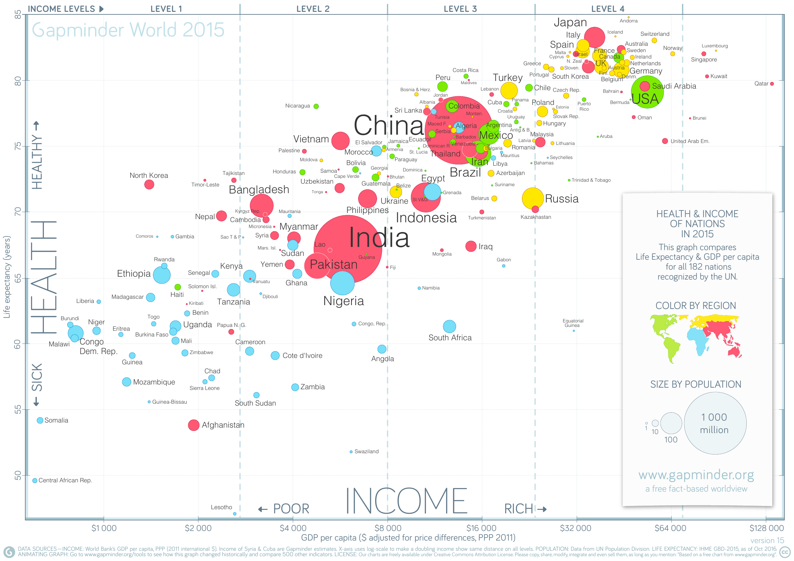

--- 
knit: "bookdown::render_book"
---

# Visualização com ggplot2 {#viz}

## Vídeo 1

```{r echo=FALSE, results='asis', out.extra=center()}
embed_yt('OBpNjqIIyhI')
```


## Componentes de um gráfico ggplot2

### Geometrias e mapeamentos estéticos (*mappings*)

* Observe o gráfico abaixo, obtido de https://www.gapminder.org/downloads/updated-gapminder-world-poster-2015/.

```{r echo=FALSE, out.width='100%'}

```

* O gráfico mostra como, em cada país, a saúde (mais precisamente, a expectativa de vida) se relaciona com a riqueza (mais precisamente, o PIB *per capita*).

* Além da expectativa de vida e o do PIB *per capita*, o gráfico traz mais informações sobre cada país.

* Cada país é representado por um ponto (a [geometria]{.hl}).

* Informações sobre cada país são representadas por características do ponto correspondente (as [estéticas]{.hl}):

  ::: {style="width: 50%; margin: auto;"}
  
  | Variável            | Geometria | Estética  |
  |---------------------|-----------|-----------|
  | PIB *per capita*    | ponto     | posição x |
  | Expectativa de vida | ponto     | posição y |
  | População           | ponto     | tamanho   |
  | Continente          | ponto     | cor       |
  
  :::

* Você pode usar outras estéticas para representar informações:

  * Cor de preenchimento.
  * Cor do traço.
  * Tipo do traço (sólido, pontilhado, tracejado etc.).
  * Forma (círculo, quadrado, triângulo etc.).
  * Opacidade.
  * etc.

* Você pode usar outras geometrias:

  * Linhas.
  * Barras ou colunas.
  * Caixas.
  * etc.
  
  
### Escalas (*scales*)

* As escalas controlam os detalhes da aparência da geometria e do mapeamento (eixos, cores etc.).

* Os eixos do gráfico acima são escalas [contínuas]{.hl}, com valores reais.

* Observe o eixo horizontal. Os valores não aumentam linearmente, mas sim exponencialmente: cada passo à direita equivale a *dobrar* o valor do PIB. O eixo horizontal segue uma [escala logarítmica]{.hl}.

* Os tamanhos dos pontos formam uma escala [discreta]{.hl}, com $4$ valores possíveis (veja a legenda no canto inferior direito do gráfico).

* As cores também formam uma escala discreta.


### Rótulos (*labels*)

* O gráfico também representa informação na forma de texto.

* Além de rótulos (por exemplo, o texto que identifica cada eixo), [o texto também pode, ele mesmo, ser uma geometria, com suas próprias estéticas:]{.hl} observe como o nome de cada país é escrito em um tamanho proporcional à sua população.


### Outros componentes

* Coordenadas:

  * Este gráfico usa [coordenadas cartesianas]{.hl}, com eixos $x$ e $y$.
  
  * Existem gráficos que usam um sistema de [coordenadas polares]{.hl}.

* Temas:

  * Incluem todos os elementos "decorativos": cor de fundo, linhas de grade, etc. Ajudam a facilitar a leitura e a interpretação.
  
  * No gráfico acima, um detalhe interessante do tema é a divisão de cada eixo em segmentos claros e segmentos escuros.
  
* Legendas (*guides*).

* Facetas:

  * Às vezes, um gráfico é composto por múltiplos subgráficos.
  
  * Cada subgráfico é uma [faceta]{.hl}.
  
  * Facetas evitam que informações demais sejam apresentadas no mesmo lugar.


## Conjunto de dados

* Nossos exemplos de gráficos vão usar dados sobre o sono de diversos mamíferos. 

* O conjunto de dados se chama `msleep` e está incluído no pacote `ggplot2`.

* Para ver a documentação, digite

  ```{r help, eval=FALSE}
  library(ggplot2)
  ?msleep
  ```

* Vamos atribuir o conjunto de dados à variável `df`:

  ```{r df}
  df <- msleep
  df
  ```

* Vamos examinar a estrutura --- usando R base:

  ```{r echo=FALSE}
  options(str = strOptions(vec.len = 3))
  ```

  ```{r str-df}
  str(df)
  ```

* Podemos usar `glimpse`, uma função do `tidyverse`:

  ```{r glimpse-df}
  glimpse(df)
  ```

* Para examinar só as primeiras linhas do *data frame*:

  ```{r head-df}
  head(df)
  ```

* Para examinar o *data frame* interativamente:

  ```{r view-df}
  view(df)
  ```

* Podemos produzir um sumário dos dados usando o pacote *summarytools* (que já foi carregado neste documento):

  ```{r summary-df, results='asis', message=FALSE}
  df %>% dfSummary() %>% print()
  ```

* Vemos que há muitos `NA` em diversas variáveis. Para nossos exemplos simples de visualização, vamos usar as colunas

  * `name` 
  * `genus` 
  * `order` 
  * `sleep_total` 
  * `awake` 
  * `bodywt` 
  * `brainwt` 

* Mas... a coluna que mostra a dieta (`vore`) tem só 7 `NA`. Quais são?

  ```{r df-vore}
  df %>% 
    filter(is.na(vore)) %>% 
    select(name)
  ```

* OK. Vamos manter a coluna `vore` também, apesar dos `NA`. Quando formos usar esta variável, tomaremos cuidado.

* Também... a coluna `bodywt` tem 0 como valor mínimo. Como assim?

  ```{r df-bodywt}
  df %>% 
    filter(bodywt < 1) %>% 
    select(name, bodywt) %>% 
    arrange(bodywt)
  ```

* Ah, sem problema. A função `dfSummary` arredondou estes pesos para 0. Os valores de verdade ainda estão na *tibble*.

* Vamos criar uma *tibble* nova, só com as colunas que nos interessam:

  ```{r sono}
  sono <- df %>% 
    select(
      name, order, genus, vore, bodywt, 
      brainwt, awake, sleep_total
    )
  ```

* Vamos ver o sumário:

  ```{r sumario-sono, results='asis', message=FALSE}
  sono %>% dfSummary() %>% print()
  ```


## Gráficos de dispersão (*scatter plots*)

* Servem para visualizar a *relação* entre [duas variáveis quantitativas.]{.hl}

* [Essa relação *não* é necessariamente de causa e efeito. ]{.hl}

* Isto é, a variável do eixo horizontal não determina, necessariamente, os valores da variável do eixo vertical.
  
* Pense em [associação]{.hl}, [correlação]{.hl}, não em causalidade.

* Troque as variáveis de eixo, se ajudar a deixar isto claro.


### Horas de sono e peso corporal

* Como as variáveis `sleep_total` e `bodywt` estão relacionadas?

  ```{r sono-peso-plot-1}
  sono %>% 
    ggplot(aes(x = bodywt, y = sleep_total))
  ```

* O que houve? Cadê os pontos?

* O problema foi que só especificamos o mapeamento estético (com `aes`, que são as iniciais de *aesthetics*). [Faltou a geometria.]{.hl}

  ```{r sono-peso-plot-2}
  sono %>% 
    ggplot(aes(x = bodywt, y = sleep_total)) +
    geom_point()
  ```

* Que horror. 

* A única coisa que percebemos aqui é que os mamíferos muito pesados dormem menos de $5$ horas por noite.

* Estes animais muito pesados estão estragando a escala do eixo $x$.

* Que animais são estes?

  ```{r pesados}
  sono %>% 
    filter(bodywt > 250) %>% 
    select(name, bodywt) %>% 
    arrange(bodywt)
  ```

* Além disso, há muitos pontos sobrepostos. Em bom português, temos um problema de *overplotting*. 

* Existem diversas maneiras de lidar com isso.

* A primeira delas é [alterando a opacidade dos pontos]{.hl}. Isto é um ajuste na geometria apenas, pois a opacidade, aqui, não representa informação nenhuma.

  ```{r sono-peso-plot-alfa}
  sono %>% 
    ggplot(aes(x = bodywt, y = sleep_total)) +
      geom_point(alpha = 0.2)
  ```

* Outra maneira é usar `geom_jitter` em vez de `geom_point`. "*Jitter*" significa "tremer". As posições dos pontos são ligeiramente perturbadas, para evitar colisões. Perdemos precisão, mas a visualização fica melhor.

  ```{r sono-peso-plot-jitter}
  sono %>% 
    ggplot(aes(x = bodywt, y = sleep_total)) +
      geom_jitter(width = 100)
  ```


* Vamos mudar os limites do gráfico para nos concentrarmos nos animais menos pesados. Observe que [isto é um ajuste na escala]{.hl}.

  ```{r sono-peso-plot-3}
  sono %>% 
    ggplot(aes(x = bodywt, y = sleep_total)) +
      geom_point() +
      scale_x_continuous(limits = c(0, 200))
  ```

* Nestes limites, a relação entre horas de sono e peso não é mais tão pronunciada.


### Horas de sono e peso corporal para animais pequenos

* Vamos restringir o gráfico a animais com no máximo $5$kg.

  ```{r limite}
  limite <- 5
  ```

* Em vez de mudar a escala do gráfico, vamos filtrar as linhas do *data frame*:

  ```{r sono-peso-plot-pequenos}
  sono %>% 
    filter(bodywt < limite) %>% 
    ggplot(aes(x = bodywt, y = sleep_total)) +
      geom_point()
  ```

### Incluindo a dieta

* Com a estética `color`. Observe como a legenda aparece automaticamente.

  ```{r plot-sono-peso-dieta}
  sono %>% 
    filter(bodywt < limite) %>% 
    ggplot(aes(x = bodywt, y = sleep_total, color = vore)) +
      geom_point()
  
  ```


### A estética pode ser especificada na `geom`

* Compare com o código anterior.

  ```{r plot-sono-peso-dieta-geom}
  sono %>% 
    filter(bodywt < limite) %>% 
    ggplot() +
      geom_point(aes(x = bodywt, y = sleep_total, color = vore))
  ```

* Fazendo deste modo, a estética só vale para uma geometria. Se você acrescentar outras geometrias (linhas, por exemplo), a estética não valerá para elas.


### Aparência fixa ou dependendo de variável?

* Se for fixa, não é estética. Não representa informação.

* Se depender de variável, é estética. Representa informação.

* Compare o último *chunk* acima com:

  ```{r plot-sono-peso-cor}
  sono %>% 
    filter(bodywt < limite) %>% 
    ggplot() +
      geom_point(aes(x = bodywt, y = sleep_total), color = 'blue')
  ```

* Se for uma estética, precisa estar [associada a uma variável]{.hl}, não a um valor fixo. Um erro comum seria fazer:

  ```{r plot-sono-peso-cor-erro}
  sono %>% 
    filter(bodywt < limite) %>% 
    ggplot() +
      geom_point(aes(x = bodywt, y = sleep_total, color = 'blue'))
  ```


### Uma correlação mais clara

* Peso cerebral versus peso corporal:

  ```{r cerebro-corpo}
  sono %>% 
    ggplot() +
      geom_point(aes(x = bodywt, y = brainwt))
  ```

* Vamos restringir aos animais mais leves e mudar a opacidade:

  ```{r cerebro-corpo-2}
  sono %>% 
    filter(bodywt < limite) %>% 
    ggplot() +
      geom_point(aes(x = bodywt, y = brainwt), alpha = .5)
  ```

* Vamos incluir horas de sono e dieta. Observe as estéticas usadas.

  ```{r cerebro-corpo-3}
  sono %>% 
    filter(bodywt < limite) %>% 
    ggplot() +
      geom_point(
        aes(
          x = bodywt, 
          y = brainwt,
          size = sleep_total,
          color = vore
        ), 
        alpha = .5
      )
  ```

* Vamos mudar a escala dos tamanhos e incluir rótulos:

  ```{r cerebro-corpo-4}
  sono %>% 
    filter(bodywt < limite) %>% 
    ggplot() +
      geom_point(
        aes(
          x = bodywt, 
          y = brainwt,
          size = sleep_total,
          color = vore
        ), 
        alpha = .5
      ) +
      scale_size(
        breaks = seq(0, 24, 4)
      ) +
      labs(
        title = 'Peso do cérebro versus peso corporal',
        subtitle = paste0(
          'para mamíferos com menos de ', 
          limite, 
          ' kg'
        ),
        caption = 'Fonte: dataset `msleep`',
        x = 'Peso corporal (kg)',
        y = 'Peso do\n cérebro (kg)',
        color = 'Dieta',
        size = 'Horas\nde sono'
      )
  ```


## Histogramas e cia.

* A idéia agora é [agrupar indivíduos em classes,]{.hl} dependendo do valor de uma variável quantitativa.


### Distribuições de frequência

* Vamos nos concentrar nas horas de sono.

  ```{r vetor-horas-sono}
  sono$sleep_total
  ```

* Antes de montar o histograma, vamos construir uma [distribuição de frequência.]{.hl}

* A [amplitude]{.hl} é a diferença entre o valor máximo e o valor mínimo. A função `range` não retorna a amplitude, mas sim os valores mínimo e máximo:

  ```{r amplitude-sono}
  sono$sleep_total %>% range()
  ```

* Vamos decidir que cada classe vai ter $2$ horas. A função `cut` substitui os valores do vetor pelos nomes das classes:

  ```{r cut-horas-sono}
  sono$sleep_total %>% 
    cut(breaks = seq(0, 20, 2), right = FALSE)
  ```

* A função `table` faz a contagem dos elementos de cada classe:

  ```{r dist-table-sono}
  sono$sleep_total %>%  
    cut(breaks = seq(0, 20, 2), right = FALSE) %>% 
    table(dnn = 'Horas de sono') %>% 
    as.data.frame()
  ```

### Histograma

* Na verdade, o `ggplot2` já faz esses cálculos para nós.

* O *default* é criar $30$ classes (*bins*):

  ```{r hist-sono1}
  sono %>% 
    ggplot(aes(x = sleep_total)) +
      geom_histogram()
  ```

* Vamos mudar isto passando um vetor de limites das classes (*breaks*):

  ```{r hist-sono2}
  sono %>% 
    ggplot(aes(x = sleep_total)) +
      geom_histogram(breaks = seq(0, 20, 2)) +
      scale_x_continuous(breaks = seq(0, 20, 2))
  ```

### Polígono de frequência

* Em vez das barras do histograma, podemos desenhar uma linha ligando seus topos.

* O resultado é um [polígono de frequência]{.hl}.

  ```{r hist-freqpoly}
  pf <- sono %>% 
    ggplot(aes(x = sleep_total)) +
      geom_freqpoly(breaks = seq(0, 20, 2), color = 'red') +
      scale_x_continuous(breaks = seq(0, 20, 2))
      
  pf
  ```

* Vamos sobrepor o polígono de frequência ao histograma, para deixar claro o que está acontecendo:

  ```{r hist-freqpoly2}
  pf + geom_histogram(breaks = seq(0, 20, 2), alpha = .3)
  ```


## Ogiva

* A ogiva é um gráfico que mostra a [frequência acumulada]{.hl}: para cada valor $v$ da variável no eixo $x$, a proporção de indivíduos com valor menor ou igual a $v$.

* A geometria `geom_step` gera o gráfico de uma [função degrau]{.hl}. 

* Cada geometria está ligada a uma [`stat`], um algoritmo para computar o que vai ser desenhado. Aqui, passamos para a geometria [a função `ecdf` (*empirical cumulative distribution function*), que calcula as frequências acumuladas.]{.hl}

  ```{r ogiva}
  sono %>% 
    ggplot(aes(x = sleep_total)) +
      geom_step(stat = 'ecdf') +
      scale_x_continuous(breaks = seq(0, 20, 2)) +
      scale_y_continuous(breaks = seq(0, 1, .1)) +
      labs(y = NULL)
  ```

* Com a ogiva, podemos obter informações difíceis de visualizar no histograma. Por exemplo: 

  * Cerca de $20\%$ dos mamíferos têm menos de $6$ horas de sono.

  * Cerca de metade dos mamíferos têm menos de $10$ horas de sono.

  * Cerca de $10\%$ dos mamíferos têm mais de $16$ horas de sono.


## Ramos e folhas

* No início dos anos $1900$, quando estatísticas eram feitas à mão, Arthur Bowley criou os [diagramas de ramos e folhas]{.hl}.

* Um diagrama de ramos e folhas é, basicamente, uma listagem de todos os valores de uma variável, agrupados de maneira que todos os valores de uma classe (i.e., de uma linha) têm os algarismos iniciais dentro de um intervalo.

* Para as horas de sono dos mamíferos:

  ```{r stem-and-leaf}
  sono$sleep_total %>% 
    stem()
  ```

* A primeira linha representa um indivíduo com $0{,}9$ horas de sono.

* A penúltima linha representa $3$ valores:

  * $16{,}6$
  * $17{,}0$
  * $17{,}4$
  

## Exercícios

1. Construa um histograma da variável `brainwt`. Escolha o número de classes que você achar melhor. O que acontece com os valores `NA`?

2. Construa um *scatter plot* de horas de sono versus peso do cérebro. Você percebe alguma correlação entre estas variáveis? 
